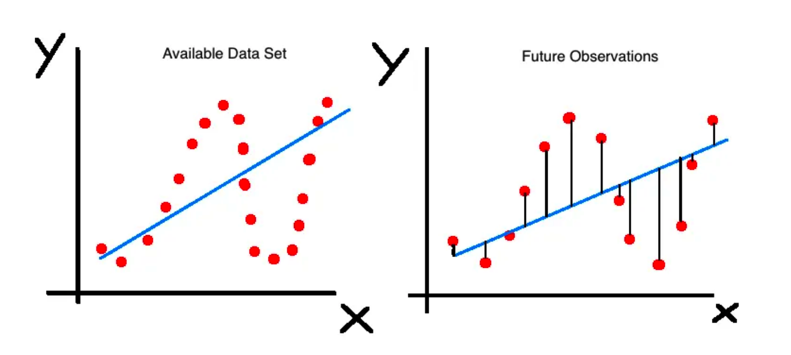

```{r initialload,echo=FALSE}
suppressMessages(library(tidyverse))
suppressMessages(library(rpart))
suppressMessages(library(caret))
suppressMessages(library(pls))
suppressMessages(library(mlbench))
```

# Preface

NOTE: This document is a work in progress and should be considered to be in *"draft status"*

This content exists to motivate use of the **caret** package. Much of the first part (well all of it really) is designed to show how one would use various modeling methods in the R language to build predictive models. Another way to say this is that I'm trying to "scare" you into using **caret** because it provides conveniences and capabilities that help you focus on building models over trying to understand the sometimes arcane syntax associated with the individual modeling functions in R. There is nothing wrong with being able to go deep into a specific method in terms of parameter tuning though you should first start learning how to build models after which we'll discuss appropriate assessment strategies.

Of course, there is absolutely no requirement for anyone to use the **caret** package but it provides a uniform interface (for the most part) to over 200 modeling methods. All one needs to do is have some data, a metric by which to score (e.g. RMSE, AUC, logloss), and a method of interest. 

The **caret** package will handle the underlying interaction with the corresponding R method and return results in an object. It's "reason for being" is to show you how well your selected model might apply to "out of sample" data. For now, though, take a tour through the "old school" way of doing predictive modeling in R after which I'll introduce **caret** (You can always skip to Section 6).

# Predictive / Supervised Learning

In Predictive Learning it is customary to apply methods to build  models on existing data to help you 
  1) understand the data at hand and 
  2) maybe build a model to predict outcomes on related information  

Of course, number 2 assumes that what you already know is suitable for application to a more general situation when this might not be the case. 

## Explanation vs Prediction

Sometimes you just want to build a model (apply a method) to **explain** the data at hand as opposed to using it to predict outcomes for incoming data of a related nature. Not all models need to be predictive and in fact it might be useful to first get a basic understanding of the data before attempting to extend it to new information. 

> "A common misconception in various scientific fieldsis that predictive power can be inferred from explana-tory power. However, the two are different and should be assessed separately."
>
> --- Gamit Shmueli - "To Explain or Predict"

Given a data set, there might be some variable therein that you would like to predict in terms of other variables. Ideally you would like to automate this process but not at the expense of understanding the underlying statistical considerations. The process should also be done in a way that allows one to define a specific performance measure / metric that can then be used to compare performance across a number of "models".

## Two Types of Predictive Models:

In this lecture we'll be focusing on the following situations. In Supervised Learning we have known outcomes that can be leveraged in the creation of a model(s) that can then be used to predict labels for new data sets. 

   - For Quantitative Data, we'll consider Regression
   - For Qualitative Data, we'll consider Classification 

As previously mentioned, we will need metrics to evaluate performance of any models we build. For Regression, we'll use Root Mean Square Error (RMSE). The formula looks like the following where P represents a vector of predictions and O represents a vector of the observed (true) values.

\[
RMSE = \sqrt\frac{\sum_i^n(P_i-O_i)^2}{n}
\]


For Classification, we'll use measures derived from a  **Confusion Matrix** in conjunction with a **ROC Curve**. We'll discuss this in greater detail in a later section. 

## Bias vs Variance

See [this blog](https://thatdatatho.com/2018/08/08/explaining-bias-variance-trade-off-machine-learning/) for more information.

Think of the term **bias** as meaning **deviation from the truth or reality**. If a model fits some data very well then deviations from the actual values will be small which is what you might expect when applying the model to the very data used to produce it. You are able to **explain** the data but not then be able to use it to predict outcomes without experiencing large variance. 

Any performance metric that is computed on the data "as is" will typically be somewhat optimistic in the context of predictive utility. The model you build on some data might fit the data very well (low bias) but then does not do very well when applied to a new data set wherein the model exhibits large variance. 

## Overfitting and Underfitting

If we **overfit** some data we then undermine our ability to apply it to new data in a way that results in good performance. This is the case where we have high model bias and resulting high variability when it is applied to new data. If you do "too good of a job" of learning some data then you might actually be unknowingly modeling inherent sources of error. 


If we **underfit** some data then consider that we haven't "learned enough" from it to ensure low bias (deviations from reality). On the other hand if the model does a "good enough job" of describing the data then maybe it's not a big deal especially since, when applied to new data, it doesn't exhibit a high degree of variance. 

Simpler models, such as linear regression, can be like this - easy to understand but somewhat biased in their assessment of data. Depending on the size of the data it might be computationally less expensive to build more biased models.



Models that are biased generally have less variability when applied to new data whereas less biased models generally have higher variability when applied to new data. Obviously, striking a balance between the two is desirable. There are techniques to help with this. 

# A Motivating Example - Linear Regression

Thus far we haven't gotten our hands dirty but we'll need to do that if we want an experiential approach to any of this. Let's start out with what is probably the most (over)used data set in R Education - the "mtcars" data frame. 

```{r mtcarshelp,eval=FALSE}
Motor Trend Car Road Tests

The data was extracted from the 1974 Motor Trend US magazine, 
and comprises fuel consumption and 10 aspects of automobile 
design and performance for 32 automobiles (1973–74 models).

A data frame with 32 observations on 11 (numeric) variables.

[, 1]	mpg	  Miles/(US) gallon
[, 2]	cyl	  Number of cylinders
[, 3]	disp  Displacement (cu.in.)
[, 4]	hp	  Gross horsepower
[, 5]	drat	Rear axle ratio
[, 6]	wt	  Weight (1000 lbs)
[, 7]	qsec	1/4 mile time
[, 8]	vs	  Engine (0 = V-shaped, 1 = straight)
[, 9]	am	  Transmission (0 = automatic, 1 = manual)
[,10]	gear	Number of forward gears
[,11]	carb	Number of carburetors
```

## Scatterplot

Let's look at a **pairs()** plot to see if there are any obvious linear relationships between any of the variables. Some of these variables can be considered as factors or categories (such as cyl, vs, am, gear, and carb) so for now we will exclude them to focus only on the continuous / measured variables.

```{r pairsplot}
pairs(mtcars[,c(1,3:7)])
```

## Correlations

Let's look at some correlations to see how we might predict MPG as a function of other variables in the data set. Note that this isn't an in-depth modeling lecture so we will fast track over deep discussions on how to fully evaluate and diagnose a model emerging from a specific method - although that is important. But, in the interest of motivating a work flow, we'll simplify some of those discussions for now.


```{r corrplot1}
suppressMessages(library(corrplot))
mydata.cor = cor(mtcars[,c(1,3:7)], method = c("spearman"))
corrplot(mydata.cor)
```

There are some strong correlations here and perhaps a case could be made for collinearity but we aren't going to get into that right now. We also have variables on different measurement scales but, again, we'll hold off dealing with that for the moment. 

```{r corrplot2}
corr.df <- as.data.frame(as.table(mydata.cor))
cdf <- corr.df %>% 
  filter(Freq != 1.0 & abs(Freq) > 0.5) %>%
  arrange(desc(abs(Freq)))

cdf[seq(1,nrow(cdf),2),] %>%  
  arrange(desc(abs(Freq)))
```

## Building A Model - In Sample Error

So now we will use the above information to build a linear model using the mtcars data frame. We'll turn around and use the same exact data frame to test our model - Any resulting error we see will be **in sample** error and will not generalize well to new data. The model will not help us anticipate any **out of sample error**. 

```{r mtcarslm}
data(mtcars)

# Let's evaluate a basic formula
myform <- formula(mpg~wt)

# Use the built in "lm" function
lm_model <- lm(myform,data=mtcars)
summary(lm_model)

# Do the predictions on the data set used to train the
# model. This isn't what you want to do in the real world

training_preds <- predict(
    lm_model,
    newdata=mtcars,
    type="response"
  )
```

So let's see what this looks like graphically. Remember that we want to be able to compute the Root Mean Square Error for this model:

```{r lmplot}
title <- "lm - mpg~wt"
plot(mpg~wt,mtcars,pch=19,main=title,
     ylim=c(min(mtcars$mpg)-5,max(mtcars$mpg)))
abline(lm_model)
grid()
segments(mtcars$wt,training_preds,
         mtcars$wt,mtcars$mpg,
         col="red",lwd=1.2)
```

Let's compute the RMSE for this model. The formula for this is:

\[
RMSE = \sqrt\frac{\sum_i^n(P_i-O_i)^2}{n}
\]


```{r}
errors <- training_preds-mtcars$mpg
training_rmse   <- sqrt(mean(errors^2))
print(training_rmse)
```

We might even want to create a function to do this for future use:

```{r}
# Lets define a rmse function for future use
compute_rmse <- function(preds,known) {
  errors <- preds-known
  rmse   <- sqrt(mean(errors^2))
  return(rmse)
}

compute_rmse(training_preds,mtcars$mpg)
```

Is this good ? Bad ? Just average ? Well we don't really know. One good thing is that the metric is in terms of the predicted variable, **mpg**, so it can easily be interpreted. 

However, unless someone has specified a tolerance level for the RMSE we don't know if we have something that can be extended to other car types. We also could experiment with other regression formula to see if the RMSE goes down (or up). 

## Out Of Sample Data

Now let's repeat this exercise by generating a linear model on a subset of the mtcars data frame and then apply that model to the remaining data. In modeling parlance this is known as having a "training" and "test" data set. 

The idea here is to build a model using say the first 21 rows of mtcars (a training set that is roughly 65% of the data) and then use a test set, rows 22 - 32 of mtcars, as input to the model to determine how well the model performs. 

Remember - we want to minimize the RMSE. The first 21 rows are outlined in green and rows 22-32 are outlined in red. This means we are training on a subset of the data and we hope that any model we build thereon will be extensible to the holdout or test data frame


```{r}
lm_model_train <- lm(myform,data=mtcars[1:21,])

# Do the prediction on the test set
test_preds <- predict(
    lm_model_train,
    newdata=mtcars[22:32,],
    type="response"
  )

(test_rmse <- compute_rmse(test_preds,mtcars[22:32,]$mpg))
```

We trained the model on the first 21 rows of the data frame which might contain some outliers (or not). The RMSE got larger ! Does this mean the model is "bad" ? Maybe, maybe not. 

One thing we could do is to experiment with another split of the data, perhaps in a different proportion (e.g. 80/20) or maybe even a series of splits to see if we can get an idea of how widely the RMSE varies. Here we create a sample of 80% of mtcars to create a training set.  

```{r}
# Shuffle the row numbers of the data frame

(train_index <- sample(1:nrow(mtcars),nrow(mtcars)*.80))

# Get 80% of the records from the data frame
train_df <- mtcars[train_index,]

# We have approx 80% of the data in train_df
nrow(train_df)

# Get the other 20% that we wish to test on
test_df  <- mtcars[-train_index,]
nrow(test_df)

```

Now do the modeling

```{r}
train_model_lm <- lm(myform, data=train_df)

# Test the model on the test / holdout data frame

test_pred  <- predict(
  train_model_lm,
  newdata=test_df,
  type="response"
)

(test_rmse <- compute_rmse(test_pred,test_df$mpg))
```

What we have done here is to sample some portion of the original data frame to use as a training set while holding out the rest of the data to use as a test data  to see how well our model performed. We could repeat this (re)sampling activity multiple times to better train our data over different segments or "folds" of data so any model we ultimately generate will "learn" as much from the data as it can without modeling any "noise". There are various methods for doing this including K-Fold Cross Validation and Bootstrap Resampling. Let's dig in a little deeper into these methods because they help us build models that might offer more robust performance when applied to new data. 


# Training / Test Data

https://www.stat.berkeley.edu/~aldous/157/Papers/shmueli.pdf

> Predictive power is assessed using metrics computedfrom  a  holdout  set  or  using  cross-validation  (Stone,1974; Geisser,1975)

> Testing the procedure on the data that gaveit birth is almost certain to overestimate performance”(Mosteller  and  Tukey,1977).

Let's extend this idea of training and test splits. To increase the usefulness of a model we can take a single data set and partition / split it into a number of subsets. We just did that, but only once. We can then train the model on one of the splits (or combined splits) and then test it out on one of the unused subsets. This can help avoid over fitting.

In our case - what would the RMSE look like if we created say K number of subsets of the data frame and selectively held out each of the K subsets, built a model on the combined remaining subsets, and then tested the model on the holdout ? We would then average the RMSE to get an idea of its variation. The series of sequential steps would be as follows:

    Subset the data frame into k groups 
    For each subset:
       Consider the subset as a "hold out"" or test data set
       Combine the remaining subsets as a training data set
       Fit a model on the combined training set 
       Evaluate the model using the holdout test set
       Save the evaluation score (e.g. RNSE)
    
    Summarize evaluation score (e.g. mean of RMSE)


This is called Cross Validation. Here is the general idea in illustrated form relative to mtcars. Assume we want 4 folds. We would divide the data frame into 4 folds of 8 records each. The first model would be built using Fold 1 as the holdout / test data set **after** first combining Folds 2,3 and 4 into a training set set


So the second iteration would then take the second fold as the holdout / test data frame and combine Folds 1,3, and 4 into a training data frame.


```{r}
# Generates Some Folds

num.of.folds <- 8

# This generates 8 groups of 4 indices such that each
# group has unique observations. No observation is used
# more than once - although we could use bootstrapping

folds <- split(sample(1:nrow(mtcars)),1:num.of.folds) 

# We should have 32 indicies across the 8 groups 
sum(sapply(folds,length))

```

Check out the folds to get a better understanding of what is going on.  Remember that each with K-fold


```{r}
folds
```

Each list element has the indices of four unique observations from the data frame. We have eight folds with four elements each for a total of 32 numbers corresponding to row numbers from the mtcars data frame. 

## Cross Fold Validation Continued

To implement the cross validation, we will create a processing loop that will execute once for each of the 8 folds. During each execution of the loop we will create a model using data combined from all folds **except** the fold corresponding to the current loop number (e.g, 1, 2, .. 8).

Once the model is built we then test it on the fold number corresponding to the current loop number. 

So now we can create some lists to contain the models that we make along withe the associated predictions, errors and computed RMSE. We we can inspect any of the intermediate results after the fact to validate our work or look more closely at any specific result. 


```{r modloop1}
# Next we setup some blank lists to stash results
folddf    <- list()  # Contains folds
modl      <- list()  # Hold each of the K models
predl     <- list()  # Hold rach of the K predictions
rmse      <- list()  # Hold the computed rmse for a given model

# Now, for each of the 8 subgroups of holdout data we will 
# create a lda model based on all the data *except* the 
# holdout group

for (ii in 1:length(folds)) {
  
  # This list holds the actual model we create for each of the 
  # 10 folds
  
  modl[[ii]] <- lm(formula = myform, 
                   data = mtcars[-folds[[ii]],] 
                )
  
  # This list will contain / hold the models build on the fold
  
  predl[[ii]]  <- predict(modl[[ii]],
                          newdata=mtcars[folds[[ii]],],
                          type="response")
  
  # This list will hold the results of the confusion matrix 
  # function. This obkect will contain info on the 
  # accuracy,  sensitivity/recall, specificity
  # and so on for each model per fold
  
    errors <- predl[[ii]]-mtcars[folds[[ii]],]$mpg
    rmse[[ii]] <- sqrt(mean(errors^2))
}
```

The above list structures allow us to drill down into any aspect of the models and predictions we have made for each of the 8 folds. More importantly we can see how well the model works against each of the individual holdout / test data sets. In the end, we just want to be able to look at the average RMSE across the folds. This gives us clues as to how good the model might perform against new data. 

```{r latticeplot}
rmse <- unlist(rmse)
lattice::dotplot(rmse,
                 main="RMSE Across Folds Using K-Fold CV")
mean(rmse)
sd(rmse)
```

## Create A Function To Automate Things

Since we have gone to the trouble of creating a loop structure to process the folds, we could easily turn this into a function to automate the splitting of the data frame across some arbitrary number of folds just to get an idea of how the RMSE looks for different numbers of folds. We could even have our function accommodate different formula if we wanted but we won't focus on that right now. You will soon discover that the **caret** package does these kinds of things for you but we aren't quite there yet. 

```{r mtcarsfunc}
make_mtcars_model <- function(formula=myform, num_of_folds=8) {
  folds <- split(sample(1:nrow(mtcars)),1:num_of_folds) 
  
  modl      <- list()
  predl     <- list()
  rmse      <- list()

  # Now, for each of the 10 subgroups of holdout data we will 
  # create a lda model based on all the data *except* the 
  # holdout group

  for (ii in 1:length(folds)) {
  
  # This list holds the actual model we create for each of the folds
  
  modl[[ii]] <- lm(formula = myform, 
                   data = mtcars[-folds[[ii]],] 
                )
  
  # This list will contain / hold the models build on the fold
  
  predl[[ii]]  <- predict(modl[[ii]],
                          newdata=mtcars[folds[[ii]],],
                          type="response")
  
  # Let's compute the RMSE and save it
  
    errors <- predl[[ii]]-mtcars[folds[[ii]],]$mpg
    rmse[[ii]] <- sqrt(mean(errors^2))
  }
  return(rmse=unlist(rmse))
}
```

HTTP://stat.cmu.edu/~brian/724/week11/lec27-bootstrap.pdf

Let's look at the average RMSE across 4 folds. 

```{r fourfold}
num_of_folds <- 4

rmse <- make_mtcars_model(num_of_folds)

title <- paste("RMSE Across",num_of_folds,
               "folds - ",as.character(deparse(myform)),sep=" ")


print(mean(rmse))
lattice::dotplot(rmse,
                 main="RMSE Across Folds Using K-Fold CV")
sd(rmse)
boxplot(rmse,main=title)
```

## Repeated Cross Validation

Since we already have an existing function we can up the ante by repeating the cross validation. This will provide more data on how the RMSE might be distributed across multiple runs, each of which does Cross Fold validation. This example will repeat a 4 Fold Cross Validation , 20 times.  

```{r}
num_of_folds <- 4

# Just to be clear - here is what happens when we call the function
# once. We get back 4 RMSE values - one for each fold

(rmse <- make_mtcars_model(num_of_folds))

# Now we repeat this some number of times - like 10. So we get back
# 80 RMSE values 

repeated_cv_rmse <- sapply(1:20,make_mtcars_model)

boxplot(repeated_cv_rmse, 
        main="RMSE Across 20 Repeats of 4 CV Folds")

title <- paste("RMSE Across",num_of_folds,
               "folds - ",as.character(deparse(myform)),sep=" ")

repeated_cv_rmse <- as.vector(repeated_cv_rmse)
boxplot(repeated_cv_rmse)
summary(repeated_cv_rmse)

```


## Bootstrap 

An alternative to K-Fold Cross Validation is to use the bootstrap sampling approach which will produce training data sets the same size as the original data set although some observations might be repeated as the sampling process is done with replacement. The observations that do not appear in each of the training sets are then used as a test set. These observations are known as "out of bag samples". We'll make a function to do bootstrap sampling.  


```{r}
make_mtcars_boot <- function(formula=myform, num_of_folds=8) {

  modl      <- list()
  predl     <- list()
  rmse      <- list()

  # Now, for each of the 10 subgroups of holdout data we will 
  # create a lda model based on all the data *except* the 
  # holdout group

  for (ii in 1:length(folds)) {
  
    training_boot_idx <- sample(1:nrow(mtcars),replace=TRUE)
    test_boot_idx <- !(1:32 %in% training_boot_idx)
    
  # This list holds the actual model we create for each of the folds
  
  modl[[ii]] <- lm(formula = myform, 
                   data = mtcars[training_boot_idx,] 
                )
  
  # This list will contain / hold the models build on the fold
  
  predl[[ii]]  <- predict(modl[[ii]],
                          newdata=mtcars[test_boot_idx,],
                          type="response")
  
  # Let's compute the RMSE and save it
  
    errors <- predl[[ii]]-mtcars[test_boot_idx,]$mpg
    rmse[[ii]] <- sqrt(mean(errors^2))
  }
  return(rmse=unlist(rmse))
}
```


```{r}
num_of_folds <- 8

# Just to be clear - here is what happens when we call the function
# once. We get back 8 RMSE values - one for each fold
(rmse <- make_mtcars_boot(num_of_folds))

# Now we repeat this some number of times - like 10. So we get back
# 80 RMSE values 

repeated_rmse <- sapply(1:20,make_mtcars_boot)

boxplot(repeated_rmse,main="RMSE Across 20 Repeats of 4 Boostrap Folds")
title <- paste("RMSE Across",num_of_folds,
               "folds - ",as.character(deparse(myform)),sep=" ")

boot_repeated_rmse <- as.vector(repeated_rmse)
boxplot(boot_repeated_rmse)

# How does the RMSE from the boostrap approach compare to the 
# K-Fold CV approach ? 

print("Summary of Bootstrap RMSE")
summary(boot_repeated_rmse)

print("Summary of CV")
summary(repeated_cv_rmse)
```


# Using Methods Other Than lm

Let's look at random forests for this to see if it improves the situation. Note that we aren't, at least at this point, trying to understand the underlying details and subtleties of any of alternative functions we might use although that is ultimately very important. However, in the interest of motivating action, we'll defer the conversation until later.

https://stats.stackexchange.com/questions/330153/predictors-in-random-forest#330154

> The random forest algorithm, as implemented by Breiman, is designed such that each predictor is given a fair chance to manifest its importance in the overall forest model. Each tree is built by taking a random set of features, and then choosing the feature with the best split at each node, starting with the root. Features/predictors which are relevant will influence the tree heavily in the first few splits."

So we can somewhat blindly use the function to get a sense of what the most important predictors are as well as how many trees to "grow" in order to minimize errors. We could also adjust the **mtry** parameter to see influence how many variables are randomly sampled at each tree split. For now. well stick with some basic defaults:

```{r datasplit}
percent <- .80
idx <- sample(1:nrow(mtcars),round(percent*nrow(mtcars)))

train <- mtcars[idx,]
test  <- mtcars[-idx,]

```


```{r loadrflib}
suppressMessages(library(randomForest))

# See https://www.r-bloggers.com/part-4a-modelling-predicting-the-amount-of-rain/

my_rf <- randomForest(mpg~.,
                      data=train,
                      mtry=3,      # This is the default 
                      importance=TRUE)

# Check out the predictions

(test_pred_forest <- predict(my_rf,test))

(rmse_rf <- compute_rmse(test_pred_forest,test$mpg))

#
mean(rmse_rf)
```


```{r rfimport}
imp <- importance(my_rf)
imp.features <- tibble(variables = row.names(imp), 
                       importance = imp[, 1])
#

ggplot(imp.features, 
       aes(x= reorder(variables, importance) , 
           y = importance)) +
                  geom_bar(stat = "identity") + 
                  coord_flip() +
                  theme_bw() +
                  xlab("") + 
                  ylab("important")+
                  ggtitle("Key Variables \n") +
          theme(plot.title = element_text(size=18))

```

So the thing here is that we have a parameter called **mtry** that influences the outcome but is not necessarily something that we know how to optimally set without some experimentation. The **mtry** value is the number of variables that are randomly sampled at each tree split.

The method will pick a default value based on the number of predictor variables but it's not guaranteed to be the best value - it's just a starting point.  We could write a loop to "walk through" various values of the **mtry** parameter. 


```{r rffunctiondef}
make_mtcars_rf <- function(mtry=3) {
    my_rf <- randomForest(mpg~.,
                   data=train,
                   mtry=mtry,
                   importance=TRUE)

# Check out the predictions
    (test_pred_rf <- predict(my_rf,test))
    (rmse_rf <- compute_rmse(test_pred_rf,test$mpg))

    return(rmse_rf)
}
```

So now we could check out RMSE for varying values of **mtry**. The following will call the **randomForest** package 5 times. Starting with the first iteration, the value of **mtry** will be 3, the next time it will be 4, and so on until the last iteration where it will be 8. This is just an experiment to see if varying **mtry** will help minimize the RMSE of our model. We also have to be careful not to pick incorrect values for **mtry** so reading the help page for the **randomForest** package would be helpful. For now, let's assume that what we are doing is okay.

```{r rfloop}
sapply(3:8,make_mtcars_rf)
```

While this is fine, it would be nice if there were an easier way to handle this process. Besides, if we pick another method (e.g. the **ranger** function) then we have to deal with whatever arguments that method requires. This leads to a more general discussion on **model parameters** vs **hyperparameters**.

## Parameters vs Hyperparameters

**Model parameters** are things that are generated as part of the modeling process. They are the product or result of model fitting. These might be things like slope and intercept from a linear model.

**Hyperparameters** (sometimes called **metaparameters**) represent information that is supplied in the form of an argument prior the call to the method to generate results. These parameters might not be something one can intelligently set without some experimentation. 

Of course most modeling functions one would call in R have default values for various arguments but this does not mean that the defaults are appropriate for all cases. 

To see the hyper parameters of the **lm** function, check the help page or use the **args** function. As an example, the **method** argument is a hyper parameter which has a default value of **qr**. This could be changed but one would need a reason to do so. 

```{r lmarg}
args(lm)
```


## Hyperparameter Tuning

The process of finding the "right" values for these parameters is generally referred to as "hypermarket tuning". Different values are supplied for each invocation of a method (as we did in the above example) to see the effect on the model. We might do this many times to arrive at the optimal parameter set to produce a model that offers the "best" explanatory and predictive power. 

Just to review - things like coefficients and residuals are parameters that are generated by a call to the **lm** function. They don't actually exist until the function does some work. However, the "weights" parameter referred to in the help page for the **lm** function is a **hyperparameter** since one sets this (or accepts the default value) prior to running the command. So **hyperparameters** are specific to whatever algorithm (and supporting R function) you are using. Concepts such as coefficients and intercept, however, are parameters that would be generated by any method that implements linear regression. 

More generally, what if we wanted to use other functions to do some predicting ? There are some reasonable alternatives to the humble **lm** function. But they would require some investigation prior to use to understand what parameters are supported by those respective functions. 

```{r printargs}
print("rpart arguments")
args(rpart)
#

print("glm arguments")
args(glm)
#

print("pls args")
args(plsr)

print("random Forest arguments")
args(randomForest)
```


# Caret Package

By now you are probably fatigued with understanding the details of writing the code to split data, doing Cross Validation, storing the results, and looking at descriptive stats associated with the resulting RMSE. And this is all before considering the various parameters associated with whatever method we wish to implement. Each function has its own set of requirements which may not extend to other functions. What we need (well, what we would like) is a framework to streamline this process and automate it as much as possible but not at the expense of understanding the results. 

The [**caret**](https://topepo.github.io/caret/index.html) (**C**lassification **A**nd **R**egression **T**raining) package provides a uniform interface for calling different algorithms while simplifying the data splitting and RMSE calculation. It supports many different model types and also provides the ability to tune hyper parameters. 

While being able to understand how to work with each specific function individually is a worthy goal, you might consider using caret to help you get up and running quickly. It is still your responsibility to know what the results are telling you - there is no magic here though the process of running different models and managing data is greatly simplified by using this package (at least I think so).

Note that **caret** provides a nice wrapper around the various modeling functions. Since each underlying model is itself a standalone R package and associated set of functions you can always call them directly should you prefer that approach. That's what we have been doing in the earlier part of this text. 


## Putting caret To Work

It's easy to get lost in all that we have been doing so let's review what the typical predictive modeling workflow will look like:

 1) Data Import (.csv., extraction from a database, etc)
 2) Data Visualization 
 3) Data Prep 
        - Missing, imputation
        - Scaling 
        - Create dummy variables / one hot encoding
        - Dimensionality Reduction
        
 3) Data Splitting (training / test)
        - Determine split ration
        - K-Fold Cross Validation (repeated)
        
 4) Modeling 
        
 5) Model Evaluation 
 
To do step 5 requires some predefined idea of a performance metric. We have been using RMSE and will continue to do so as we rework some of the previous examples using the caret package. 

## Back To The Beginning

It is implied that in predictive modeling the ultimate goal is to generate a model that could be reasonably applied to new data. As we have learned, it is best to train any model on a data set that has been (re)sampled in some way (e.g. K Fold CV) which should help provide a more realistic estimate of "out of sample" error. 

In our earliest example we tried to predict the MPG from mtcars using a basic linear modeling function. The caret package provides a uniform way to do this which allows us to easily substitute in alternative functions without having to majorly change our code. We can call the **train** function in such a way as to pass in any arguments that are specific to a method though in a way that allows for minimal alteration. We can also tell the **train** function that we want to evaluate RMSE as a performance measure. That is, it will "know" that our primary performance measure for a model is RMSE. Before we do that, however, we'll make a test / train pair. The **caret** package provides ways to do that. 

## Splitting

**createDataPartition** can be used to create test and train data splits according to some proportion. There is a function called **createFolds** can be used to generate balanced cross–validation groupings from a set of data. **createResample** can be used to make simple bootstrap samples. For now, we'll just stick with **createDataPartition** for creating a test/train pair.

```{r createdata}
idx <- createDataPartition(mtcars$mpg, p = .8, 
                                  list = FALSE, 
                                  times = 1)
head(idx)

Train <- mtcars[ idx,]
Test  <- mtcars[-idx,]

#
nrow(Train)
nrow(Test)
```
To actually create a model involves use of the **train** function which is the premier function in the **caret** package. It does what it name suggests - train models. Note that we tell it:

  1) What we are trying to predict (a formula)
  2) What our data set is (e.g. Train)
  3) The desired method ("ml")
     - Note that this method name MUST match an existing R modeling function
  4) A desired scoring metric. In this case we seek to minimize RMSE on 
     future predictions 

```{r lmftrain}
lm_fit <- train(mpg~wt,
                data=Train,
                method="lm",
                metric="RMSE")
```

We get back a single object that contains a lot of information that could help us figure out if the model is worth anything. But first, just type the name of fit object to see what you can see. This shows us information that has been derived from some re sampling activity across a number of bootstrapped samples. 

```{r printlmfit}
lm_fit
summary(lm_fit)
```

So let's apply this model to the test data frame

```{r rmsef}
compute_rmse(predict(lm_fit,Test),Test$mpg)
```

There is more here than meets the eye. 

```{r nameslmfit}
names(lm_fit)
```


```{r lmfitctrl}
str(lm_fit$control,1)
```

Check out the some of the model characteristics

```{r}
summary(lm_fit)
summary(lm_fit$finalModel)$r.squared
```

We can go right to the final Model which contains the information for the 

```{r lmfit1}
lm_fit$finalModel
```

So it looks like caret did some re sampling for us by default. However, we can specify cross fold validation if we wanted to. This requires a more involved form of the **train** function.

You can influence the **train** function by passing a "special" list to it via the **trControl** argument. This gets a bit confusing because the primary function to train models is called **train** and the command used to create the special is called **trainControl** and the argument in the **train** function is called **trControl**. With use, it becomes easier to remember the difference though at first it's confusing. 

Here we train the model as before but specifically requesting a Cross Fold Validation method of 10 times. We are requesting verbose output. 


```{r}
my_lm <- train(
  mpg ~ ., 
  Train,
  method = "lm",
  trControl = trainControl(
    method = "cv", 
    number = 5,
    verboseIter = TRUE
  )
)
```

So the object returned from caret gives us an estimate of how well the model will perform (based on RMSE) for out of sample data. 

```{r}
my_lm
compute_rmse(predict(my_lm,Test),Test$mpg)
```

We could also repeat the 5 times CV validation an arbitrary number of times to generate greater confidence in the RMSE estimates returned by the model. Remember, a major reason for using K Fold validation is to better estimate the out of sample error by holding out a portion of the data frame being trained upon. 


```{r}
my_lm <- train(
  mpg ~ ., 
  Train,
  method = "lm",
  trControl = trainControl(
    method = "repeatedcv",    # Note "rpeatedcv"
    number = 5,
    repeats = 5
  )
)

compute_rmse(predict(my_lm,Test),Test$mpg)
```

As a matter of convenience, you can create a variable to hold
the content of  **trainControl** and then pass that to the function. 
This is subjective and either approach is fine. 

```{r}
my_ctrl <- trainControl(
    method = "cv", 
    number = 5,
    verboseIter = TRUE
  )

my_lm <- train(
  mpg ~ ., 
  Train,
  method = "lm",
  trControl = my_ctrl
)

compute_rmse(predict(my_lm,Test),Test$mpg)
```

## One Size Fits All

So this is where things get interesting. If we wanted to use another method such as Random Forests, we do NOT have to change much at all. We just provide the name of the desired method which in this case, is **rf**. Of course, there might be parameters specific to the new method but we'll hold off that for now.


```{r}
my_ctrl <- trainControl(
    method = "cv", 
    number = 5,
    verboseIter = TRUE
  )

my_rf <- train(
  mpg ~ ., 
  Train,
  method = "rf",
  trControl = my_ctrl
)

my_rf

compute_rmse(predict(my_rf,Test),Test$mpg)
```

We can get a plot of how the RMSE and R squared value varied with different values of **mtry**. Here we see that an mtry value of 6 randomly selected columns / variables provides the lowest RMSE. 

```{r}
ggplot(my_rf) + theme(legend.position = "top")
```


We can use the **tuneLength** argument to tell the **train** function to use N different values of **mtry** which is a **hyperparameter** to the randomForest package. The value relates to the number of columns in the data frame. We have 11 total and we are trying to predict one of them (mpg). So we can tell the **train** function to randomly select N variables (up to 10) when a tree is split. 


```{r}
my_ctrl <- trainControl(
    method = "cv", 
    number = 5,
    verboseIter = TRUE
  )

my_rf <- train(
  mpg ~ ., 
  Train,
  method = "rf",
  tuneLength = 9,    # We'll use 9 different values
  trControl = my_ctrl
)

my_rf
plot(my_rf)

compute_rmse(predict(my_rf,Test),Test$mpg)
```

If you have a questions about what hyper parameters can be tuned for a given method then you can refer to the online [caret documentation](https://topepo.github.io/caret/available-models.html) Here is a screenshot of the table of supported models and associated tuning parameters. 


Another way to do this within the caret package itself is that if you already know the abbreviation for the specific method you wish to use (e.g. "rf") then you can use some built in functions to help you. Remember that **caret** does not replace or rewrite functions, it merely provides a nice wrapper around them. Since each underlying model is it a standalone R package and associated set of functions you can always call them directly. 

```{r}
modelLookup("rf")
```

Here we get the hyper parameters for the **ranger** function. We see that it has three hyper parameters that could be varied in some way to influence a final model.


```{r}
modelLookup("ranger")
```

If you just want a list of all the models supported by caret then do something like this:

```{r}
models <- modelLookup()[,1:3]
nrow(models)

# Search for a Model
models[models$model=="rf",]
models[models$model=="ranger",]

```

So in the case of the **ranger** function there are actually three hyper parameters that could be tuned. 

```{r}
my_ctrl <- trainControl(
    method = "cv", 
    number = 3,
    verboseIter = FALSE 
  )

my_ranger <- train(
  mpg ~ ., 
  Train,
  method = "ranger",
  tuneLength = 6,    
  trControl = my_ctrl
)

my_ranger

compute_rmse(predict(my_ranger,Test),Test$mpg)

plot(my_ranger)
```


# Picking The Best Model

This is arguably one of the best features of the **caret** package as it helps us execute any number of models and then assess their performance on new data. Let's look at our models thus far. In fact, it's so easy to generate them with caret, we'll just make them here again. Let's set a common **trainControl** list. We'll use the **Train** and **Test** sets from above.


```{r}
my_ctrl <- trainControl(
    method = "cv", 
    number = 3
  )
```


Now let's build a model using three different methods. We'll use the **set.seed** function to make sure that the underlying data used to train the models are the same. This allows for a better comparison.

```{r}
set.seed(127)   # For reproducibility
mod_lm     <- train(mpg ~ ., 
                    data=Train, 
                    method = "lm",
                    trControl = my_ctrl)

set.seed(127)
mod_rf     <- train(mpg ~ ., 
                    data=Train, 
                    method = "rf", 
                    trControl = my_ctrl)

set.seed(127)
mod_ranger <- train(mpg ~ ., 
                    data=Train, 
                    method = "ranger", 
                    trControl = my_ctrl)
```


```{r}
# Look at the results of the hyperparameter tuning
plot(mod_rf)

#
plot(mod_ranger)
```

## Using the resamples() function

Now, here comes the "magic". Because we built three different modeling objects on the same data set, we can now use the **resamples** function to collect, analyze, and visualize a set of results. This is pretty powerful. 

```{r}
results <- resamples(list(lm=mod_lm,rf=mod_rf,ranger=mod_ranger))
summary(results)
```


```{r}
bwplot(results)
```


```{r}
dotplot(results)
```

## Model Performance

Of course, we can now use the Test data frame to see how the RMSE looks on the holdout data frame. 


```{r computermse}
compute_rmse(predict(mod_lm,Test),Test$mpg)
compute_rmse(predict(mod_rf,Test),Test$mpg)
compute_rmse(predict(mod_ranger,Test),Test$mpg)
```

Another way to look at these models is to use the **diff** function. 

```{r}
(difs <- diff(results))

# Get the summary

summary(difs)
```

```{r}
compare_models(mod_lm,mod_rf)
```

```{r}
compare_models(mod_ranger,mod_lm)
```

## Feature Selection

Features are the columns in your data set. Up until now we have not been concerned with the formula being specified choosing rather to focus on how to run models with the caret package. However, knowing how to select the "best" subset of features is important since an overspcified formula might result in very long training times and, even then, it might not be that good of a model for predicting out of sample error. Of course, various methods have ways to deal with this problem. 

For example, Stepwise regression is one way to look at combinations of predictor variables to arrive at the optimal feature set according to some score (e.g. AIC, BIC). This process is implemented recursively. However, none of this should be a substitute for solid intution about the data or knowing how features vary with each other (if at all). Still, packages such as caret have ways to assist with feature selection. We'll look at a few here:

### Recursive Feature Elimination

The general idea with this approach is to build models using combinations of predictors to arrive at the best model according to some metric such as RMSE. Some predictors might be discarded along the way resulting in a "leaner" feature set that would then hopefully be easier to defend than a more complex or fully specified feature set. There is no free lunch here in that blindly accepting the features handed to you by a recursive or automatic method should not be considered authoritative especially if you have a reason to believe that some key feature has been exlcuded. Many people, however, like to use these methods as a starting point. You would still need to review the diagnostics associated with a final model to determine if it is statistically sound. 

According to the [**caret** documentation](https://topepo.github.io/caret/feature-selection-overview.html#models-with-built-in-feature-selection) there are a large number of supported models that contain some form of embedded or built-in feature selection. Such functions are doing you a favor (or not) by showing you the importance of contributing features. 


#### An Example

Let's work with the **lm** function again to see if we can find some interesting features using some caret functions. The main function for Recursive Feature Elimination is **rfe** which, like the **train** function, accepts a control object to help guide the process. Here we are telling the **rfe** function to use some helper functions to assess predictors. We don't need to pass it a model - it handles these things under the hood. In this case we'll use 10 Fold Cross Validation.

```{r}
set.seed(123)
control <- rfeControl(functions=lmFuncs, method="cv",number=10)

results <- rfe(mtcars[,2:11],     # Predictor features
               mtcars[,1],        # Predicted features - mpg
               sizes=c(1:5),      # pick groups of predictors 1-5 
               rfeControl=control)
results
plot(results,type=c("o","g"))
```

What we get back is some idea about the important features. We could then build a model with caret that uses only these features to see if the suggested RMSE value mentioned in the rfe process matches. 

### Redundant Feature Removal

The **caret** package has some functions that can help us identify highly correlated variables that might be a candidates for removal prior to use in building a model. Let's go back to the mtcars data set as it exists by default. One of the variables that is highly correlated with others is **mpg** Since that is the one we are trying to predict, we'll keep it around.


```{r}
correlations <- cor(mtcars[,-1])

# Find all correlated variables above .75
(highcorr <- findCorrelation(correlations, cutoff=.75))

# We might want to remove these from the data frame before modeling
mtcars[,-1][,highcorr]
```

### Feature Importance

```{r}

```


# Data Pre Processing

*Note: This section is in development* 

In an earlier section we looked at the correlations between the variables in the mtcars data frame. 

## Look for Highly Correlated Variables

```{r}
data(mtcars)
correlations <- cor(mtcars)
correlations[1:6, 1:6]
```


```{r}
suppressMessages(library(corrplot))
corrplot(correlations, order="hclust")
```

The **caret** package has some functions that can help us identify highly correlated variables that might be a candidates for removal prior to use in building a model. Let's go back to the mtcars data set as it exists by default. One of the variables that is highly correlated with others is **mpg** Since that is the one we are trying to predict, we'll keep it around.


```{r}
(highcorr <- findCorrelation(correlations, cutoff=.75))
```

```{r}
new_mtcars <- mtcars[,-highcorr[highcorr != 1]]
```


## Scaling Considerations

One thing we skipped over entirely is the issue of data scale. Well, actually, I did mention it at the beginning but then moved on. This is actually a big deal since the data we have been working on has variables measures on different scales. In fact, some of them are actually not continuous quantities. The columns of mtcars that might be categories or factors include cyl, am, vs, gear, and carb. Why do I say this ? We'll they only take on a specific set of values over all observations

```{r}
sapply(new_mtcars,function(x) length(unique(x)))
```

So, technically, we could turn these into factors before doing anything with the data. We'll handle these types of variables momentarily. But for now let's look at a pairs plot of the new_mtcars data frame.

```{r}
pairs(new_mtcars)
```

```{r}
sapply(new_mtcars,range)
```

Anyway, the caret package provides a way to easily scale the data prior to the processing of it. We can do this as we call the **train** function. Note that the scaling happens underneath the covers. First, let's create a Train / Test pair.

```{r createmoredata}
idx <- createDataPartition(new_mtcars$mpg, p = .8, 
                                           list = FALSE, 
                                           times = 1)
Train <- mtcars[ idx,]
Test  <- mtcars[-idx,]
```


```{r rfctrol}
my_ctrl <- trainControl(
    method = "cv", 
    number = 3
  )

# Check the preProcess argument below

mod_rf <- train(mpg ~ ., 
                data=Train, 
                method = "rf", 
                preProcess = c("center","scale"),
                trControl = my_ctrl
                )

compute_rmse(predict(mod_rf,Train),Train$mpg)
```

Another possibility exists in that we could use the **preProcess** function in advance of calling the **train** function. We'll work with the Train and Test data from above.

```{r protrain}
proc_train <- preProcess(Train,method = c("center","scale"))
scaled_train <- predict(proc_train, Train)

# Then we would use the data along with the train function

mod_lm_sc <- train(mpg~.,data=scaled_train,method="lm")
```

If we wanted to then predict against a new data set we would then need to scale the new data.

```{r testscale}
Test_sc <- data.frame(scale(Test))
predict(mod_lm_sc,Test_sc)
compute_rmse(predict(mod_lm_sc,Test_sc),Test_sc$mpg)
```

# Classification Problems

Next up we consider the issue of building a model to predict a binary (e.g. "yes" / "no" or "positive / "negative") outcome although we might also predict more than one class. For the sake of explanation we'll keep our attention to the "two class" situation. As an example, the mtcars data frame has a variable called **am** which indicates whether a car has an automatic or manual transmission. This is indicated, respectively, by a 0 and 1.

```{r}
head(mtcars)
```

We could build a classification model to predict whether a car had an automatic or manual transmission based on one or more variables from the data frame. A more general example might be predicting whether a patient has tested positive or negative for a condition. Unlike prediciting a continuous outcome, we would be classifying an outcome as one thing or another. Evaluating such a model involves more than just computing RMSE. Let's explore some considerations that need to be made. 

## Hypothesis Testing 

Now, before we dig into the details our classifier, remember that most things in statistics and classification revolves around the idea of a hypothesis. In this case, the "null" hypothesis is that a patient does NOT have the disease whereas the alternative hypothesis is that they do. Well, for a statistician that's a bit strong. Let's just say that if there is enough evidence to reject the null hypothesis then we will. 

### Type I and II Errors 

Anyway, the larger idea is that we might apply our test to someone and subsequently determine that they have a disease when in fact they don't. This would be an example of a "false positive" also known as a "Type I Error".  It is also possible that we apply the test to someone and we say that the do not have the disease when they actually do. This is known as a "false negative" also known as a Type II Error" wherein we fail to reject the null hypothesis for this person. A perfect test would have zero false positives and zero false negatives

## Performance Measures 

With Linear Regression we were predicting a continuous outcome with the goal of being able to minimize the RMSE (root mean square error). In classification problems we need a metric or "performance measure" that we can use to judge the effectivness of any model we create. 

Let's say that we are predicting whether someone has a disease or not. Pretend we have a classifier that we use against a blood sample to make this determination. The outcome is either a 1 which means that the patient is positive for the condition whereas an outcome of 0 represents a negative. 

## Table of Outcomes

We'll generate two vectors here with one being named "actual" that represents the "truth" or "reality" of the situation. This is our reference against which we will compared our predictions. The second vector, imaginatively named "predicted", contains the predictions. 

```{r}
# Pretend that this vector represents the actual condition status for the patients
set.seed(123)
actual <- factor(sample(c(0,1),20,T),levels=c(1,0))

# Pretend that we generated the following predictions using a really cool, highly-sophisticated model
set.seed(321)
predicted <- factor(sample(c(0,1),20,T),levels=c(1,0))
```

We can now compare the predicted against the actual to see how "good" our model is. This table provdes the basis from which we can compute a number of performance measures 

```{r}
(myt <- table(predicted,actual))
sum(myt)
```

So first of all we notice that there are N = 20 people in this study. It might be helpful to view this table using some terminology:

{width=1200}

True Positives - With respect to the first row - we predicted that 4 people have the disease that actually do have it. You could then say that the number of TRUE POSITIVES (abbreviated as "TP") is 4. 

False Positives - We also predicted that 4 people have the condition when they in fact do not. We could then say that the number of FALSE POSITIVES, abbreviated as "FP", is 7. This is also known as a "Type 1" error. 

False Negatives - In the second row we predicted that 7 people do NOT have the disease/condition when they actually do. So you could say that the number of FALSE NEGATIVES (abbreviated as FN) is 7. 

True Negatives - We also predicted that 5 people do not have the condition and they do not. So then the number of TRUE NEGATIVES (abbreviated as TN) is also 5. 
 

### Computing Performance Metrics

Now comes the fun part in that you might be concerned with specific metrics to assess the quality of your model in specific terms. Since our model, such as it is, seems to relate to the quality of a medical diagnostic we might be concerned with its accuracy, precision, and sensitivty. The first two terms in particular are frequently used synonymously when they are not the same thing. Remember that we have N = 20 patients. Below is a graphic from Wikipedia which presents many (if not all) of the metrics that can be computed against a confusion matrix. 

{width=1200}

We'll focus on some specific metrics as they will assist our understanding of how to assess a model.


```{r}
myt
sum(myt)
```

#### Accuracy 

So let's take the number of observed True Positives and True Negatives, add them together, and divide them by the total number of patients in the study group to arrive at what is known as the **Accuracy** of our model. Another way to think of the denominator is as the sum of all observed results, True and False. 

Accuracy =  (TP + TN) / (TP + TN + FP + FN) = 9/20 = 0.45

```{r}
(accuracy <- (myt[1,1] + myt[2,2]) / sum(myt))
```

#### Precision

How precise is the model ? This is computed in a different fashion. We take the number of True Postives (TP) and divide that by the sum of True Positives (TP) and False Positives (FP). The denominator is the sum of row 1 in our table myt.

Precision = TP / (TP + FP) = 4 / (4 + 4) = 0.5

```{r}
(precision <- myt[1,1]/(myt[1,1]+myt[1,2]))
```

It is helpful to know that **Precision** is also known as the PPV "Positive Predictive Value" since it is concerened with the ratio of True Positives over the sum of all Positive related quantities including the False Positives. The larger the number of FP then the smaller the ratio which results in a lower precision. 

#### Sensitivity

Sensitivity is related to Precision except the ratio we look at is the number of True Positives (TP) divided by the sum of True Positives and False Negatives (which are actually Positives). This tells us how frequently we find a positive case given that it is actually positive. 

Sensitivity = TP / (TP + FN) = 5 / (5 + 4) = 0.5555

```{r}
(sensitivity <- myt[1,1]/(myt[1,1]+myt[2,1]))
```

Sensitivity also has synonyms: recall, hit rate, or True Positive Rate (TPR). For example, the concept of True Positive Rate might be more intutitive for you to understand although scientific medical literature might reference Sensitivity. 

#### Specificity

Specificity tells us how frequently we find a negative case given that it is actually negative. This is also known as the "True Negative Rate"

Specificity = TN / (TN + FP) = 5 / (5 + 4) = 0.5555

```{r}
(specificity <- myt[2,2]/(myt[2,2]+myt[1,2]))
```

#### False Positive Rate

We compute the FPR as follows:

False Positive Rate = FP / FP + TN = 4 / 4 + 5 


```{r}
(fpr <- myt[1,2] / (myt[1,2] + myt[2,2]))
```

## Picking the Right Metric

There are more ratios we could compute some of which might be more relavant to our classification issue. In reality, picking the "right" metric is a function of your domain of study. Frequently, the sensitivity and specicity are used in medical testing scenarions as is the false positive rate. But you should search the literature in your area of interest to determine what is commonly used. We could say much more about these metrics but we'll keep it simple for now. 

Where are we ? We compared some predictions against reality and computed some ratios. The problem with this is that we don't yet know from where the predictions came ? Well, we imagined that the predicted values came from some classification model we created though we didn't specify one. Let's take a real example here to illustrate some important points. 

Let's use the **PimaIndiansDiabetes** data frame from the **mlbench** package to predict whether a person has diabetes or not. This is just a basic example here, we aren't trying to create a sophisticated model.

```{r}
data("PimaIndiansDiabetes")
pm <- PimaIndiansDiabetes

# Create a logistic regression model
glm_model <- glm(diabetes ~ .,data=pm,family="binomial")
```

Now that we have a model, let's do some predictions. What we get back are probabilities (values between 0 and 1). We now have to figure out an appropriate threshold value that, if exceeded, will result in a classification of "positive" for diabetes.  

```{r}
glm_probs <- predict(glm_model,pm,type="response")
round(glm_probs,4)[1:20]
```

Let's create a boxplot of these probabilities. 

```{r}
par(mfrow=c(1,2))
boxplot(glm_probs)
grid()
hist(glm_probs)
par(mfrow=c(1,1))
```

### Working With Prediction Probabilities 

So now we need to write some code to decide how to best use these probabilities to make the predictions. We'll start with 0.5. (That's what most people do anyway). If the predicted probability corresponding to that observation is >= 0.5 then we'll say that the person has diabetes. If not, then they will be classified as negative. 

```{r}
t <- 0.5
diabetes <- ifelse(glm_probs >= t,0,1)
```

Next, let's make a table which compares these predictions against the actual values. It turns out that our classifier doesn't seem to be doing a good job here. There are lots of False Negatives and Positives here. 
```{r}
(myt <- table(predicted=diabetes,true=pm$diabetes))
```

So we could then compute the metrics corresponding to this particular confusion matrix. We could compute, for example, the True Positive Rate and False Positive Rate from this data. 

```{r}
get_tprfpr <- function(pred,true) {
  myt <- table(pred,true)
  tpr <- myt[1,1]/(myt[1,1]+myt[2,1])
  fpr <- myt[1,2] / (myt[1,2] + myt[2,2])
  return(c(tpr=tpr,fpr=fpr))
}

get_tprfpr(diabetes,pm$diabetes)
```

### Creating a ROC Curve 

Let's look at the metrics associated with other threshold values. Even better let's just adjust our above function to do this for all values between 0 and 1. 

```{r}

get_tprfpr <- function(thresh,probs=glm_probs) {
  diabetes <- ifelse(probs >= thresh,1,0)
  myt <- table(diabetes,pm$diabetes)
  tpr <- myt[1,1]/(myt[1,1]+myt[2,1])
  fpr <- myt[1,2] / (myt[1,2] + myt[2,2])
  return(c(tpr=tpr,fpr=fpr))
}
```


So - This process has resulted in the creation of a ROC Curve that shows us TPR vs FPR across a large number of possible threshold values. For each selected threshold, we compute a confusion matrix from which we compute the associated tpr and fpr. When we are done, we plot tpr vs fpr. The idea with a ROC curve is to pick the threshold such that the area under the curve is maximized. While we have produced this ROC curve by hand, R provides packages to do this for us. 


```{r}
metrics <- t(sapply(seq(0.05,.95,.05),function(x) get_tprfpr(x))) 
plot(tpr~fpr,metrics,
     main="Steve's ROC Curve",
     xlab="False Positve Rate (1-Specificity)",
     ylab="True Positive Rate",type="l")
grid()

# Put the associated threshold values on the plot to help you identify
# the right value to maximize the AUC (Area Under Curve)

text(metrics[,2],metrics[,1],labels=seq(0.05,.95,.05),cex=0.9)
```


# Classification Example

Here we present data on Pima Indians as it relates to diabetes. This data is provided by the **mlbench** package. The source of the information is the National Institute of Diabetes and Digestive and Kidney Diseases which in turn was hosted on the UCI Repository of Machine Learning. The variables are:

    pregnant - Number of times pregnant
    glucose	 - Plasma glucose concentration (glucose tolerance test)
    pressure - Diastolic blood pressure (mm Hg)
    triceps	 - Triceps skin fold thickness (mm)
    insulin	 - 2-Hour serum insulin (mu U/ml)
    mass	   - Body mass index (weight in kg/(height in m)\^2)
    pedigree - Diabetes pedigree function
    age	     - Age (years)
    diabetes - Class variable (test for diabetes)
    
```{r}
library(mlbench)
data("PimaIndiansDiabetes")

# The nqme is a little long so let's shorten it up
pm <- PimaIndiansDiabetes
```

If this were more a talk on exploratory practices we might spend more time investigating the relationships between the variables. 

```{r corrplot}
library(corrplot)
mydata.cor = cor(pm[,-9], method = c("spearman"))
corrplot(mydata.cor)
```


```{r heatmap}
palette = colorRampPalette(c("green", "white", "red")) (20)
heatmap(x = mydata.cor, col = palette, symm = TRUE)
```

## Boxplots And Densities

So the object of this code is to see if there are any apparent differences for any of the variables in terms of the diabetes status of a given individual. 

```{r basebox}
par(mfrow=c(2,4))
for (ii in 1:8) {
  form <- as.formula(paste(names(pm)[ii]," ~ diabetes",sep=""))
  boxplot(form,data=pm,main=names(pm)[ii])
  grid()
}
par(mfrow=c(1,1))
```

Same plot, though created by ggplot2 commands

```{r ggplotbox}
gather(pm,key="variable",val="value",-diabetes) %>% ggplot(aes(x=diabetes,y=value)) + geom_boxplot() + facet_wrap(~variable,scales="free") + theme_bw()
```

Let's look at how the densities differ in each group (positive vs
negative).

```{r density}
splitdf <- split(pm,pm$diabetes)
par(mfrow=c(2,4))

 for (ii in 1:8) {
    a <- paste("splitdf[[1]]$",names(pm)[ii],sep="")
    plot(density(eval(parse(text=a))),main=names(pm)[ii],col="red")
    a <- paste("splitdf[[2]]$",names(pm)[ii],sep="")
    lines(density(eval(parse(text=a))),col="blue")
    legend("bottomright",
           legend=c("neg","pos"),
           col=c("red","blue"),lty=1:1,cex=0.8)
    grid()

}
par(mfrow=c(1,1))
```


## Generalized Linear Models

Let's pick a technique to model the data with the ultimate goal of being able to predict whether someone has diabetes or not. We'll start with the **glm** function in R. We'll take a kitchen sink approach where we predict the diabetes variable ("yes" or "no") based on the rest of the information in the data frame. 

```{r}
set.seed(123)
idx <- createDataPartition(pm$diabetes, p = .8, 
                                  list = FALSE, 
                                  times = 1)
head(idx)

train <- pm[ idx,]
test  <- pm[-idx,]

#
nrow(train)
nrow(test)
```

If we used the non caret approach we might do something like the following: 

```{r}
pm_model_glm <- glm(diabetes ~ .,
                        data = train, family="binomial")

pm_model_fitpreds <- predict(pm_model_glm,test,type="response")

fitpredt <- function(t) ifelse(pm_model_fitpreds > t , "pos","neg")

fitpreds <- factor(fitpredt(.4),level=levels(test$diabetes))

caret::confusionMatrix(fitpreds,
                       test$diabetes,
                       positive="pos")
```


```{r}
library(caTools)
colAUC(pm_model_fitpreds,test$diabetes,plotROC=TRUE)

```


But wait, why would we do this if we have the **caret** package readily available. We can explore any number methods, implement K Fold Cross Validation,and get feedback on the performance measures at the same time. Let's reframe our above work using the caret package conveniences. 

```{r logit1}
ctrl <- trainControl(method = "cv", 
                     number = 5
                     )

pm_glm_mod <- train(form = diabetes ~ .,
                    data = train,
                    trControl = ctrl,
                    metric = "Accuracy",
                    method = "glm",
                    family = "binomial",
                    preProc = c("center", "scale")
                    )
pm_glm_mod
pm_glm_mod$results
```

We asked for the model to be build with concern for Accuracy being the priority. This is why in the result we see an estimated 77% accuracy rate when the model is applied to out of sample data. 

```{r}
pm_glm_pred_labels <- predict(pm_glm_mod,test)
confusionMatrix(pm_glm_pred_labels,test$diabetes)
```

We can certainly change the scoring metric to prioritize, for example, the area under the associated ROC curve. We just need to make some adjustments to the trainControl argument list and the train argument list. 

```{r}
ctrl <- trainControl(method = "cv", 
                     number = 5,
                     classProbs = TRUE,
                     summaryFunction = twoClassSummary
                     )

pm_glm_mod <- train(form = diabetes ~ .,
                    data = train,
                    trControl = ctrl,
                    metric = "ROC",
                    method = "glm",
                    family = "binomial",
                    preProc = c("center", "scale")
                    )

pm_glm_mod$results
```

## Random Forests

Let's use random forests to see what results we get. Random forests are robust to over fitting and are fairly easy to implement. They can improve accuracy by fitting many trees. Each tree is fit to a resampled version of the input data (usually a bootstrap). This is known as boostrap aggregation or "bagged" trees. At each split, the function takes a random sample of columns (the mtry argument).

The function we will use here, **ranger**, has three hyper parameters which could be set to a range of values which, in turn, could influence the resulting model. With glm, we didn't really have a hyper parameter. Here is how to tell if a caret-supported model has one or more hyper parameters available for tuning:

```{r}
modelLookup("ranger")
```

We'll switch out metric back to Accuracy

```{r}
ctrl <- trainControl(method = "cv", 
                     number = 5
                     )

pm_ranger_mod <- train(form = diabetes ~ .,
                    data = train,
                    trControl = ctrl,
                    metric = "Accuracy",
                    method = "ranger",
                    preProc = c("center", "scale")
                    )
```

By default the training process will move through three different values of mtry though we could either set this explicitly in the train function or as part of the hyper parameter tuning processed mentioned previously. If we choose the latter, then we can take advantage of the fact that **caret** knows what hyper parameters the method supports and can cycle through possible valid values of these hyper parameters. This is accomplished via the **tuneLength** argument to the **train** function. We could use the **tuneGrid** argument along with a manually specified tuning grid but it's easier to use **tuneLength** for now.

```{r}
pm_ranger_mod
```


```{r}
ctrl <- trainControl(method = "cv", 
                     number = 5,
                     classProbs = TRUE,
                     summaryFunction = twoClassSummary
                     )

pm_ranger_mod <- train(form = diabetes ~ .,
                    data = train,
                    trControl = ctrl,
                    metric = "ROC",
                    method = "ranger",
                    tuneLength = 7,
                    preProc = c("center", "scale")
                    )
```

The object can be plotted. Here we see that the max AUC of .825 occurs when mtry is 3 and the Gini criterion is used to evaluate a tree. 

```{r}
plot(pm_ranger_mod)
max(pm_ranger_mod[["results"]]$ROC)
```


```{r}
preds <- predict(pm_ranger_mod,test)
confusionMatrix(preds,test$diabetes)
```

# Using External ML Frameworks

There are a number of companies that provide easy access to Machine Learning services including Google, Amazon, Data Robot, and H2o. In particular, the company [H20.ai](https://www.h2o.ai/products/h2o/) provides frameworks for accessible Machine Learning by experts and non-experts. They promote the idea of "citizen data science" which seeks to lower barriers to participation in the world of AI. While they have a commercial product, they also provide an open source tool:

> H2O is a fully open source, distributed in-memory machine learning platform with linear scalability. H2O supports the most widely used statistical & machine learning algorithms including gradient boosted machines, generalized linear models, deep learning and more. 

Moreover, H2O provides access to an "Auto ML" service that selects methods appropriate to a given data set. This is useful to help jump start ideas.

>H2O also has an industry leading AutoML functionality that automatically runs through all the algorithms and their hyperparameters to produce a leaderboard of the best models. The H2O platform is used by over 18,000 organizations globally and is extremely popular in both the R & Python communities.

Better yet, there is an [R package](https://cran.r-project.org/web/packages/h2o/index.html) called, somewhat unimaginatively, "h2o" "which provides:

> R interface for 'H2O', the scalable open source machine learning platform that offers parallelized implementations of many supervised and unsupervised machine learning algorithms such as Generalized Linear Models, Gradient Boosting Machines (including XGBoost), Random Forests, Deep Neural Networks (Deep Learning), Stacked Ensembles, Naive Bayes, Cox Proportional Hazards, K-Means, PCA, Word2Vec, as well as a fully automatic machine learning algorithm (AutoML).

## Using h2o

The package must first be installed which can done using the **install.packages** function (or the menu in R Studio). Loading the library is done just as you would any other library. 

```{r h2oload}
library(h2o)
```

The goal of using this library is not to replace the methods available to you in R but, just like the **caret** package, seeks to provide a uniform interface for a variety of underlying methods. This includes common methods including an "Auto ML" service that picks methods for you. Let's apply h2o to our work. The underlying h2o architecture uses a "running instance" concept that can be initialized and accessed from R. You initialize it once per interactive session.


```{r h2oinit,eval=FALSE}
h2o.init()

H2O is not running yet, starting it now...

Note:  In case of errors look at the following log files:
    /var/folders/wh/z0v5hqgx3dzdfgz47lnbr_3w0000gn/T//RtmpRehHby/h2o_esteban_started_from_r.out
    /var/folders/wh/z0v5hqgx3dzdfgz47lnbr_3w0000gn/T//RtmpRehHby/h2o_esteban_started_from_r.err

java version "1.8.0_131"
Java(TM) SE Runtime Environment (build 1.8.0_131-b11)
Java HotSpot(TM) 64-Bit Server VM (build 25.131-b11, mixed mode)

Starting H2O JVM and connecting: .. Connection successful!

R is connected to the H2O cluster: 
    H2O cluster uptime:         2 seconds 577 milliseconds 
    H2O cluster timezone:       America/New_York 
    H2O data parsing timezone:  UTC 
    H2O cluster version:        3.26.0.2 
    H2O cluster version age:    5 months and 5 days !!! 
    H2O cluster name:           H2O_started_from_R_esteban_pgj795 
    H2O cluster total nodes:    1 
    H2O cluster total memory:   1.78 GB 
    H2O cluster total cores:    4 
    H2O cluster allowed cores:  4 
    H2O cluster healthy:        TRUE 
    H2O Connection ip:          localhost 
    H2O Connection port:        54321 
    H2O Connection proxy:       NA 
    H2O Internal Security:      FALSE 
    H2O API Extensions:         Amazon S3, XGBoost, Algos, AutoML, Core V3, Core V4 
    R Version:                  R version 3.5.3 (2019-03-11) 

Your H2O cluster version is too old (5 months and 5 days)!
Please download and install the latest version from http://h2o.ai/download/
Show in New WindowClear OutputExpand/Collapse Output
  |===========================================================| 100%
Console~/Dropbox/ML/bookdown-minimal/
Console
Terminal

R Markdown

~/Dropbox/ML/bookdown-minimal/	
```

Once the h2o environment has been initialized then work can begin. This will take the form of using R functions provided by the h2o package to read in data and prepare it for use with various methods. Let's repeat the regression on mtcars using h2o functions. Since mtcars is already available in the the R environment we can easily import it into h2o.

```{r h2oimport, eval=FALSE}
# Import mtcars
mtcars_h2o_df <- as.h2o(mtcars)

# Idenitfy the variable to be predicted
y <- "mpg"

# Put the predictor names into a vector
x <- setdiff(colnames(mtcars_h2o_df),y)
```

## Create Some h20 Models

Now let's create some training and test data sets. We could do this ourselves using conventional R commands or helper functions from the caret package. However, the h2o package provides its own set of helpers.

```{r h2osplit, eval=FALSE}
splits <- h2o.splitFrame(mtcars_h2o_df, ratios=0.8,seed=1)
train_h2o <- splits[[1]]
test_h2o  <- splits[[2]]

train

mpg cyl disp  hp drat    wt  qsec vs am gear carb
1 21.0   6  160 110 3.90 2.620 16.46  0  1    4    4
2 21.0   6  160 110 3.90 2.875 17.02  0  1    4    4
3 21.4   6  258 110 3.08 3.215 19.44  1  0    3    1
4 18.7   8  360 175 3.15 3.440 17.02  0  0    3    2
5 18.1   6  225 105 2.76 3.460 20.22  1  0    3    1
6 14.3   8  360 245 3.21 3.570 15.84  0  0    3    4

[29 rows x 11 columns] 
```


Now let's create a model. We'll use the Generalized Linear Model function from h2o. It is important to note that this function is implemented from within h2o. That is, we are not in anyway using any existing R packages to do this nor are we using anything from the **care** package. Here we'll request a 4-Fold, Cross Validation step as part of the model assembly.

```{r h2oglmod, eval=FALSE}
h2o_glm_model <- h2o.glm(y=y,x=x,train_h2o,nfolds=4)
summary(h2o_glm_model)

#

 |===========================================================| 100%
Model Details:
==============

H2ORegressionModel: glm
Model Key:  GLM_model_R_1577927955348_1 
GLM Model: summary
    family     link                              regularization
1 gaussian identity Elastic Net (alpha = 0.5, lambda = 1.0664 )
  number_of_predictors_total number_of_active_predictors
1                         10                           9
  number_of_iterations    training_frame
1                    1 RTMP_sid_bf87_673

H2ORegressionMetrics: glm
** Reported on training data. **

MSE:  6.185253
RMSE:  2.487017
MAE:  1.940791
RMSLE:  0.1135999
Mean Residual Deviance :  6.185253
R^2 :  0.8392098
Null Deviance :1115.568
Null D.o.F. :28
Residual Deviance :179.3723
Residual D.o.F. :19
AIC :157.1413


H2ORegressionMetrics: glm
** Reported on cross-validation data. **
** 4-fold cross-validation on training data (Metrics computed for combined holdout predictions) **

MSE:  9.520966
RMSE:  3.085606
MAE:  2.478209
RMSLE:  0.1462186
Mean Residual Deviance :  9.520966
R^2 :  0.7524955
Null Deviance :1194.241
Null D.o.F. :28
Residual Deviance :276.108
Residual D.o.F. :19
AIC :169.6498


Cross-Validation Metrics Summary: 
                            mean          sd cv_1_valid cv_2_valid
mae                    2.4294133   0.4533141  3.3255308  2.6851656
mean_residual_deviance  9.431254   2.5729601  11.924386  13.098149
mse                     9.431254   2.5729601  11.924386  13.098149
null_deviance          298.56015    73.43793   429.7452  322.68143
r2                     0.7409388 0.041704282  0.6850852 0.70873845
residual_deviance         69.027   21.894964  107.31948  65.490746
rmse                   2.9984744  0.46925735  3.4531705  3.6191366
rmsle                  0.1363086 0.026307607 0.19733523 0.13199924
                       cv_3_valid cv_4_valid
mae                     1.6167169  2.0902402
mean_residual_deviance  3.6748443   9.027636
mse                     3.6748443   9.027636
null_deviance           139.37894  302.43506
r2                     0.83919096 0.73074067
residual_deviance       22.049067   81.24872
rmse                    1.9169884  3.0046024
rmsle                   0.0983199 0.11758001

Scoring History: 
            timestamp   duration iterations negative_log_likelihood
1 2020-01-01 20:21:13  0.000 sec          0              1115.56759
  objective
1  38.46785

Variable Importances: (Extract with `h2o.varimp`) 
=================================================

   variable relative_importance scaled_importance  percentage
1        wt          1.19294625        1.00000000 0.208632891
2       cyl          0.92951526        0.77917615 0.162561772
3      disp          0.78424629        0.65740287 0.137155861
4        hp          0.69294345        0.58086729 0.121188021
5      carb          0.62287613        0.52213261 0.108934035
6        am          0.55736672        0.46721864 0.097477175
7        vs          0.46246830        0.38766902 0.080880507
8      drat          0.45447201        0.38096604 0.079482047
9      gear          0.02108593        0.01767551 0.003687692
10     qsec          0.00000000        0.00000000 0.000000000
```

Now we can do a prediction on the object against the test set.

```{r h20glmpreds, eval=FALSE}
(h2o_glm_preds <- h2o.predict(h2o_glm_model,test_h2o))

#
h2o.performance(h2o_glm_model,test_h2o)

 |===========================================================| 100%
   predict
1 25.93186
2 20.67344
3 24.38237

[3 rows x 1 column] 
H2ORegressionMetrics: glm

MSE:  6.762548
RMSE:  2.60049
MAE:  2.495891
RMSLE:  0.1076563
Mean Residual Deviance :  6.762548
R^2 :  -2.052306
Null Deviance :10.87611
Null D.o.F. :2
Residual Deviance :20.28765
Residual D.o.F. :-7
AIC :36.24783

```

## Saving A Model

You can save the contents of any h2o generated model by using the **h2o.saveModel()** function. You could extract pieces of information from the S4 object but saving the model is easy to do - as is reading it back in. 

```{r saveh2o, eval=FALSE}
model_path <- h2o.saveModel(h2o_glm_model,path=getwd(),force=TRUE)

# If you need to load a previously saved model

saved_model <- h2o.loadModel(model_path)
```

## Using The h2o Auto ML Feature

Are you curious as to what model might be the "best" for your data ? This is a very fertile field of research that keeps growing and some feel will one be the dominant technology in ML - where a model picks a model.  Sounds odd but that is where it is heading. Check the current [h2o Auto ML documentation](http://docs.h2o.ai/h2o/latest-stable/h2o-docs/automl.html#automl-interface) for more details. For now, most of the Auto ML services use a set of heuristics to examine data and then find the most appropriate method to build a model. The currently supported method implementations in the opensource 
version include:

 - three pre-specified XGBoost GBM (Gradient Boosting Machine) models
 - a fixed grid of GLMs, a default Random Forest (DRF)
 - five pre-specified H2O GBMs 
 - a near-default Deep Neural Net 
 - an Extremely Randomized Forest (XRT)
 - a random grid of XGBoost GBMs
 - a random grid of H2O GBMs
 - a random grid of Deep Neural Nets. 

## Launching a Job

Of course, it all begins with the idea of specifying a performance metric such as RMSE or the area under a ROC curve. The idea here is that we specify some input, apply transformations, create a test/train pair, and then call the h2o auto function. 

```{r genautomt, eval=FALSE}
h2o_auto_mtcars <- h2o.automl(y = y, x = x,
                              training_frame = train_h2o,
                              leaderboard_frame = test_h2o,
                              max_runtime_secs = 60,
                              seed = 1,
                              sort_metric = "RMSE",
                              project_name = "mtcars")
```

Let's check out the object that is returned. It is an S4 object in R which means that it has "slots" which can be accessed via the "@" operator.

```{r accesssutomt, eval=FALSE}
slotNames(h2o_auto_mtcars)
h2o_auto_mtcars@leaderboard

[1] "project_name"  "leader"        "leaderboard"   "event_log"    
[5] "training_info"
                                        model_id
1     GBM_grid_1_AutoML_20200101_202413_model_53
2          DeepLearning_1_AutoML_20200101_202413
3 XGBoost_grid_1_AutoML_20200101_202413_model_14
4  XGBoost_grid_1_AutoML_20200101_202413_model_5
5     GBM_grid_1_AutoML_20200101_202413_model_52
6     GBM_grid_1_AutoML_20200101_202413_model_16
  mean_residual_deviance      rmse       mse       mae      rmsle
1              0.2147231 0.4633822 0.2147231 0.4138704 0.02128094
2              0.3734735 0.6111248 0.3734735 0.5076945 0.02559229
3              0.4586288 0.6772213 0.4586288 0.6318582 0.03060372
4              0.4787276 0.6919014 0.4787276 0.5760670 0.03091116
5              0.7571985 0.8701716 0.7571985 0.7831136 0.03729489
6              0.7772694 0.8816289 0.7772694 0.8020415 0.03896093

[89 rows x 6 columns] 
```

Stop the H2O instance

```{r h2oterm, eval=FALSE}
h2o.shutdown(prompt=FALSE)
```


