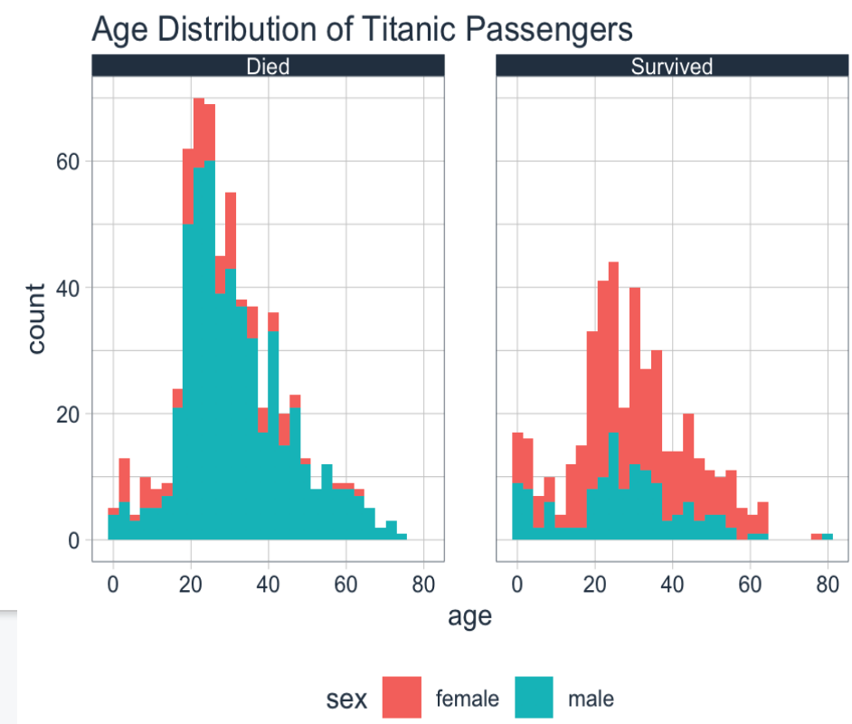
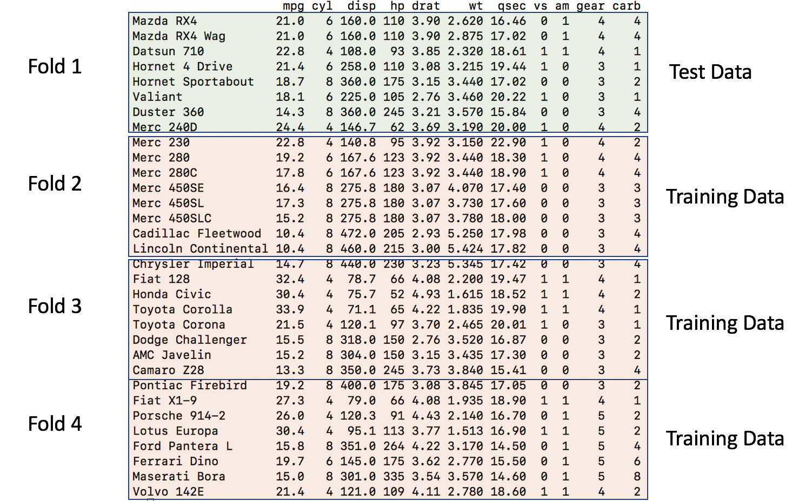
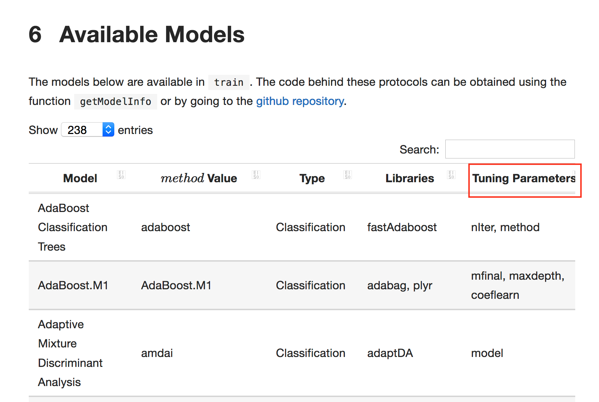

```{r initialload,message=FALSE}
library(tidyverse)
library(rpart)
library(caret)
library(pls)
library(mlbench)
library(DataExplorer)
```

# Preface

Predictive Modeling is a type of Machine Learning which itself is a sub branch of Artificial Intelligence. The [following graphic](https://blogs.nvidia.com/blog/2016/07/29/whats-difference-artificial-intelligence-machine-learning-deep-learning-ai/
) provides us with some history of these domains. This is helpful if you are trying to orient yourself in the world of analytics and machine learning. Note that AI has been around for quite some time. The Wikipedia definition of AI is:

> The study of "intelligent agents": any device that perceives its environment and takes 
> actions that maximize its chance of successfully achieving its goals


## Machine Learning

Machine Learning relies upon "patterns and inference"" to "perform a specific task without using explicit instructions". It is a form of Applied AI that attempts to automatically learn from experience without being explicitly programmed. Think of Predictive Modeling as a subset of this which falls into two categories:

**Supervised**

Algorithms that build a model on a set of data containing both the inputs and the desired outputs (“labels” or known numeric values). When you want to map input to known output labels. Build a model that, when applied to “new” data, will hopefully predict the correct label. 


Some common techniques for Supervised learning include: Generalized Linear Models (GLM),
Logistic Regression, Random Forests, Decision Trees, Neural Networks, Multivariate Adaptive Regression Splines (MARS), and K Nearest Neighbors. 


**Unsupervised**

Algorithms that take a set of data that contains only inputs, and find structure in the data (e.g. clustering of data points) 

{width=500}

Some common techniques for unsupervised learning include: hierarchical clustering, k-means
clustering, mixture models, DBSCAN, Association Rules, Neural Networks

## Predictive Modeling

This lecture is concerned primarily with Predictive Modeling. Some examples of Predictive Modeling include:

  * Predict current CD4 cell count of an HIV-positive patient using genome sequences

  * Predict Success of Grant Applications

  * Use attributes of chemical compounds to predict likelihood of hepatic injury

  * How many copies of a new book will sell ?

  * Will a customer change Internet Service Providers ? 

In this domain there are generally two types of predictive models.

## In-Sample vs  Out-Of-Sample Data 

The goal of predictive model is to generate models that can generalize to new data. It would be good if any model we generate could provide a good estimate of out of sample error. It's easy to generate a model on an entire data set (in sample data) and then turn around and use that data for prediction. But how will it perform on new data ? Haven't we just over trained our model ? 

## Performance Metrics

For either case (regression vs classification) we need some type of metric or measure to let us know how well a given model will work on new or unseen data - also known as "out of sample" data. for Classification problems we look at things like "sensitivity", "specificity", "accuracy", and "Area Under Curve". For Quantitative outcomes, we look at things like Root Mean Square Error (RMSE) or Mean Absolute Error (MAE). The selection of metric will frequently depend on your domain of interest. We'll use a couple of different methods. 

## Black Box

The good news is that you can treat building predictive models as a "Black Box".
The bad news is that you can treat building predictive models as a "Black Box".


It's better to get up and running with building some models than it is to sit back and read how to do it. The process of assessing models and diagnosing them can be an in depth process thus I don't wish to understate what it takes to do that. However, moving forward with some of the basic mechanics and concepts is good. One can always work with the individual methods or go to Section 6 to start with caret. The larger message is to get busy getting your hands dirty. 

# Predictive / Supervised Learning

In Predictive Learning it is customary to apply methods to build models on existing data to help you 

  1) Understand the data at hand and 
  2) Build a model to predict outcomes on related information  

Of course, number 2 assumes that what you already know in terms of the data and model is suitable for application to a more general situation when this might not be the case. 

## Explanation vs Prediction

Sometimes you just want to build a model (apply a method) to **explain** the data at hand as opposed to using it to predict outcomes for incoming data of a related nature. Not all models need to be predictive and in fact it might be useful to first get a basic understanding of the data before attempting to extend it to new information. 

> "A common misconception in various scientific fields is that predictive power can be inferred from explanatory power. However, the two are different and should be assessed separately."
>
> --- Gamit Shmueli - "To Explain or Predict"

Given a data set, there might be some variable therein that you would like to predict in terms of other variables. Ideally you would like to automate this process but not at the expense of understanding the underlying statistical considerations. The process should also be done in a way that allows one to define a specific performance measure / metric that can then be used to compare performance across a number of "models".

Relative to explanatory work you wish to drill down into the data to better understand it and are less concerned about how any resulting model might apply to unseen or new data. In this case you might not look at other data sets or permutated versions of the data in which case you just build different models against the same data while trying out different features to arrive a the "best" model. 

In predictive work, we typically use techniques such as cross fold validation and bootstrapping to provide us with different versions of the data to "train" a model after which we validate it on some "test" data that has been held out. So in this context, you will probably be looking at multiple versions of the original data set which adds to the overhead somewhat. 

A good example of explanatory work is the often referred to "Titanic" data set that has lots of information on the passengers who traveled on the ill-fated Titanic ship. This data set is used in many Data Science type educational contexts to talk about building models.



- While it is interesting, it’s doubtful we will save anyone’s life 
- Conclusions won’t apply to modern ship travel
- Can experiment with different algorithms without consequence
- Useful for Educational Purposes


## Two Types of Predictive Models:

In Supervised Learning we have known outcomes that can be leveraged in the creation of a model(s) that can then be used to predict labels for new data sets. This also includes numeric predictions.

   - For Quantitative Data, we'll consider Regression
   - For Qualitative Data, we'll consider Classification 

As previously mentioned, we will need metrics to evaluate performance of any models we build. For Regression, we'll use Root Mean Square Error (RMSE). The formula looks like the following where P represents a vector of predictions and O represents a vector of the observed (true) values.

\[
RMSE = \sqrt\frac{\sum_i^n(P_i-O_i)^2}{n}
\]


For Classification, we'll use measures derived from a  **Confusion Matrix** in conjunction with a **ROC Curve**. We'll discuss performance measures this in greater detail in a later section although it's intuitive that to compare a model to another model will involve the selection of some objective metric that can be used to "score" or rate them. 

## Bias vs Variance

See [this blog](https://thatdatatho.com/2018/08/08/explaining-bias-variance-trade-off-machine-learning/) for more information.

### Bias

Think of the term **bias** as meaning **deviation from the truth or reality**. If a model fits some data very well then deviations from the actual values will be small which is what you might expect when applying the model to the very data used to produce it. You are able to **explain** the data but not then be able to use it to predict outcomes without experiencing large variance. 

Any performance metric that is computed on the data "as is" will typically be somewhat optimistic in the context of predictive utility. The model you build on some data might fit the data very well (low bias) but then does not do very well when applied to a new data set wherein the model exhibits large variance. A model might not, on average, fit some existing data very well (high bias) but results in more predictable results (lower variance) when applied to new data.

### Variance

The concept of **variance** generally refers to a given algorithm's sensitivity to unfamiliar or new data. An algorithm that has been well-trained, or even over trained, on a data set might exhibit low bias in that it "knows" or "hugs" the data very well. However, when given new data that might not be from the same distribution as the "training" data then large and/or unpredictable variance might result. 

If you flip this around a bit, an algorithm whose bias is high generally means that it deviates from the "truth" perhaps to a significant degree. Correspondingly, when the resulting model is applied to new or unseen data it will behave in a more predictable manner, generally resulting in lower variance. This isn't always a bad thing. Maybe a more biased model is quick and easy to compute and it's estimated performance (as determined by some metric such as RMSE) might be acceptable when applied to new data. 

The general conclusion is that there is a trade off between Bias and Variance. The higher the bias, the lower the variance and the higher the variance, the lower the bias. 


## Overfitting and Underfitting

If we **overfit** some data we then undermine our ability to apply it to new data in a way that results in good performance. This is the case where we have high model bias and resulting high variability when it is applied to new data. If you do "too good of a job" of learning some data then you might actually be unknowingly modeling inherent sources of error. 


If we **underfit** some data then consider that we haven't "learned enough" from it to ensure low bias (deviations from reality). On the other hand if the model does a "good enough job" of describing the data then maybe it's not a big deal especially since, when applied to new data, it doesn't exhibit a high degree of variance. 

Simpler models, such as linear regression, can be like this - easy to understand but somewhat biased in their assessment of data. Depending on the size of the data it might be computationally less expensive to build more biased models.


Models that are biased generally have less variability when applied to new data whereas less biased models generally have higher variability when applied to new data. Obviously, striking a balance between the two is desirable. There are techniques to help with this. 

# A Motivating Example 

You will need to install and then load the following packages:

```{r eval=FALSE}
library(tidyverse)
library(rpart)
library(caret)
library(pls)
library(mlbench)
library(DataExplorer)
```


## Suggested Workflow

Thus far we haven't gotten our hands dirty but we'll need to do that if we want an experiential approach to any of this. It's useful to have a schematic that outlines the general process. Consider the following workflow. In general this is a solid representation of what one might do as part of building a predictive model. 


Let's start out with a basic example involving the most (over)used data set in R Education - the "mtcars" data frame. 

```{r mtcarshelp,eval=FALSE}
Motor Trend Car Road Tests

The data was extracted from the 1974 Motor Trend US magazine, 
and comprises fuel consumption and 10 aspects of automobile 
design and performance for 32 automobiles (1973–74 models).

A data frame with 32 observations on 11 (numeric) variables.

[, 1]	mpg	  Miles/(US) gallon
[, 2]	cyl	  Number of cylinders
[, 3]	disp  Displacement (cu.in.)
[, 4]	hp	  Gross horsepower
[, 5]	drat	Rear axle ratio
[, 6]	wt	  Weight (1000 lbs)
[, 7]	qsec	1/4 mile time
[, 8]	vs	  Engine (0 = V-shaped, 1 = straight)
[, 9]	am	  Transmission (0 = automatic, 1 = manual)
[,10]	gear	Number of forward gears
[,11]	carb	Number of carburetors
```

## Scatterplot

Let's look at a **pairs()** plot to see if there are any obvious linear relationships between any of the variables. Some of these variables can be considered as factors or categories (such as cyl, vs, am, gear, and carb) so for now we will exclude them to focus only on the continuous / measured variables.

```{r pairsplot}
pairs(mtcars[,c(1,3:7)])
```

## Correlations

Let's look at some correlations to see how we might predict MPG as a function of other variables in the data set. Note that this isn't an in-depth modeling lecture so we will fast track over deep discussions on how to fully evaluate and diagnose a model emerging from a specific method - although that is important. But, in the interest of motivating a work flow, we'll simplify some of those discussions for now.


```{r corrplot1,message=FALSE}
library(DataExplorer)
plot_correlation(mtcars)
```

There are some strong correlations here and perhaps a case could be made for collinearity but we aren't going to get into that right now. We also have variables on different measurement scales but, again, we'll hold off dealing with that for the moment. 

As a preview of the **caret** package, we'll use the **findCorrelation** function to help identify variables that are correlated above a certain threshold. Here, we'll identify variables that are correlated at a level of 0.7 or above. This function takes a correlation matrix as input. We have a number of variables we might consider removing but, again, we'll hold off on that for now. 

```{r corrplot2}
data(mtcars)
caret::findCorrelation(cor(mtcars),
                       cutoff = 0.7,
                       names = TRUE)
```

## Building A Model - In Sample Error

So now we will use the above information to build a linear model using the mtcars data frame. We'll turn around and use the same exact data frame to test our model - Any resulting error we see will be **in sample** error and will not generalize well to new data. However, the model will not help us anticipate any **out of sample error**. 

```{r mtcarslm}
data(mtcars)

# Let's evaluate a basic formula
myform <- formula(mpg~wt)

# Use the built in "lm" function
lm_model <- lm(myform,data=mtcars)
summary(lm_model)

# Do the predictions on the data set used to train the
# model. This isn't what you want to do in the real world

training_preds <- predict(
    lm_model,
    newdata=mtcars,
    type="response"
  )
```

So let's see what this looks like graphically. Remember that we want to be able to compute the Root Mean Square Error for this model:

```{r lmplot}
title <- "lm - mpg~wt"
plot(mpg~wt,mtcars,pch=19,main=title,
     ylim=c(min(mtcars$mpg)-5,max(mtcars$mpg)))
abline(lm_model)
grid()
segments(mtcars$wt,training_preds,
         mtcars$wt,mtcars$mpg,
         col="red",lwd=1.2)
```

Let's compute the RMSE for this model. The formula for this is:

\[
RMSE = \sqrt\frac{\sum_i^n(P_i-O_i)^2}{n}
\]


```{r rmsecal}
errors <- training_preds-mtcars$mpg
training_rmse   <- sqrt(mean(errors^2))
print(training_rmse)
```

We might even want to create a function to do this for future use:

```{r rmsedef}
# Lets define a rmse function for future use
compute_rmse <- function(preds,known) {
  errors <- preds-known
  rmse   <- sqrt(mean(errors^2))
  return(rmse)
}

compute_rmse(training_preds,mtcars$mpg)
```

Is this good ? Bad ? Just average ? Well we don't really know. One good thing is that the metric is in terms of the predicted variable, **mpg**, so it can easily be interpreted. 

However, unless someone has specified a tolerance level for the RMSE we don't know if we have something that can be extended to other car types. We also could experiment with other regression formula to see if the RMSE goes down (or up). 

## Out Of Sample Data

Now let's repeat this exercise by generating a linear model on a subset of the mtcars data frame and then apply that model to the remaining data. In modeling parlance this is known as having a "training" and "test" data set. 

The idea here is to build a model using say the first 21 rows of mtcars (a training set that is roughly 65% of the data) and then use a test set, rows 22 - 32 of mtcars, as input to the model to determine how well the model performs. 

Remember - we want to minimize the RMSE. The first 21 rows are outlined in green and rows 22-32 are outlined in red. This means we are training on a subset of the data and we hope that any model we build thereon will be extensible to the holdout or test data frame


```{r lmodmt1}
lm_model_train <- lm(myform,data=mtcars[1:21,])

# Do the prediction on the test set
test_preds <- predict(
    lm_model_train,
    newdata=mtcars[22:32,],
    type="response"
  )

(test_rmse <- compute_rmse(test_preds,mtcars[22:32,]$mpg))
```

We trained the model on the first 21 rows of the data frame which might contain some outliers (or not). The RMSE got larger ! Does this mean the model is "bad" ? Maybe, maybe not. 

One thing we could do is to experiment with another split of the data, perhaps in a different proportion (e.g. 80/20) or maybe even a series of splits to see if we can get an idea of how widely the RMSE varies. Here we create a sample of 80% of mtcars to create a training set.  

```{r lmodmt2}
# Shuffle the row numbers of the data frame

(train_index <- sample(1:nrow(mtcars),nrow(mtcars)*.80))

# Get 80% of the records from the data frame
train_df <- mtcars[train_index,]

# We have approx 80% of the data in train_df
nrow(train_df)

# Get the other 20% that we wish to test on
test_df  <- mtcars[-train_index,]
nrow(test_df)

```

Now do the modeling

```{r lmodmt3}
train_model_lm <- lm(myform, data=train_df)

# Test the model on the test / holdout data frame

test_pred  <- predict(
  train_model_lm,
  newdata=test_df,
  type="response"
)

(test_rmse <- compute_rmse(test_pred,test_df$mpg))
```

## Other Methods ? 

Could we improve the situation by using another modeling method ? This would be something that we could try with out much effort. We just have to identify an appropriate method. Let's look at a Random Forest method called **ranger**. 


```{r ranger1}
library(ranger)

# Call the ranger function 
my_rpart <- ranger(mpg ~ ., data = train_df)

# Make some Predictions
pred <- predict(my_rpart, test_df)
my_rpart_preds <- pred$predictions

# What is the RMSE 
compute_rmse(my_rpart_preds,test_df$mpg)
```

Well the computed RMSE with the **ranger** method seems to be better in the sense that it is smaller than with the **lm** function. We might be on to something or maybe we just got lucky. We need a better way to proceed - something with more rigor. 

## Summary

Aside from trying an alternative method to **lm** what we have done here is to sample some portion of the original mtcars data frame to use as a training set while holding out the rest of the data to use as a test data  to see how well our model performed. We could repeat this (re)sampling activity multiple times to better train our data over different segments or "folds" of data so any model we ultimately generate will "learn" as much from the data as it can without modeling any "noise". 

There are various methods for doing this including K-Fold Cross Validation and Bootstrap Resampling. Let's dig in a little deeper into these methods because they help us build models that might offer more robust performance when applied to new data. 


# Training / Test Data

https://www.stat.berkeley.edu/~aldous/157/Papers/shmueli.pdf

> Predictive power is assessed using metrics computedfrom  a  holdout  set  or  using  cross-validation  (Stone,1974; Geisser,1975)

> Testing the procedure on the data that gaveit birth is almost certain to overestimate performance”(Mosteller  and  Tukey,1977).

Let's extend this idea of training and test splits. Remember, our goal is to generate a robust model that better estimates out-of-sample error. We can do this by resampling our data set in a way that allows us to learn from the data but not so much so that it follows the data set too closely.

We can take a single data set and partition / split it into a number of train / test subsets. We just did that in the earlier section but we only did it once. If we do this a number of times we hope we are training our model more effectively.

What would the RMSE look like if we created say K number of subsets of the data frame and selectively held out each of the K subsets, built a model on the combined remaining subsets, and then tested the model on the holdout ? We would then average the RMSE to get an idea of its variation. The series of sequential steps would be as follows:

    Subset the data frame into k groups 
    For each subset:
       Consider the subset as a "hold out"" or test data set
       Combine the remaining subsets as a training data set
       Fit a model on the combined training set 
       Evaluate the model using the holdout test set
       Save the evaluation score (e.g. RNSE)
    
    Summarize evaluation score (e.g. mean of RMSE)


This is called K-Fold Cross Validation. Here is the general idea in illustrated form relative to mtcars. Assume we want 4 folds. We would divide the data frame into 4 folds of 8 records each. The first model would be built using Fold 1 as the holdout / test data set **after** first combining Folds 2,3 and 4 into a training set set




So the second iteration would then take the second fold as the holdout / test data frame and combine Folds 1,3, and 4 into a training data frame.


```{r}
# Generates Some Folds

num_of_folds <- 8

# This generates 8 groups of 4 indices such that each
# group has unique observations. No observation is used
# more than once - although we could use bootstrapping

folds <- split(sample(1:nrow(mtcars)),1:num_of_folds) 

# We should have 32 indicies across the 8 groups 
sum(sapply(folds,length))

```

Check out the folds to get a better understanding of what is going on. We generated a list that has 8 elements each of which holds a 4 element vector corresponding to indices for records in the mtcars data frame. 


```{r}
folds
```

Again, each list element has the indices of four unique observations from the data frame. We have eight folds with four elements each for a total of 32 numbers corresponding to row numbers from the mtcars data frame. 

## Cross Fold Validation 

To implement the cross validation, we will create a processing loop that will execute once for each of the 8 folds. During each execution of the loop we will create a model using data combined from all folds **except** the fold corresponding to the current loop number (e.g, 1, 2, .. 8).

Once the model is built we then test it on the fold number corresponding to the current loop number. 

So now we can create some lists to contain the models that we make along withe the associated predictions, errors and computed RMSE. We we can inspect any of the intermediate results after the fact to validate our work or look more closely at any specific result. 


```{r modloop1}
# Next we setup some blank lists to stash results
folddf    <- list()  # Contains folds
modl      <- list()  # Hold each of the K models
predl     <- list()  # Hold rach of the K predictions
rmse      <- list()  # Hold the computed rmse for a given model

# Now, for each of the 8 subgroups of holdout data we will 
# create a lda model based on all the data *except* the 
# holdout group

for (ii in 1:length(folds)) {
  
  # This list holds the actual model we create for each of the 
  # 10 folds
  
  modl[[ii]] <- lm(formula = myform, 
                   data = mtcars[-folds[[ii]],] 
                )
  
  # This list will contain / hold the models build on the fold
  
  predl[[ii]]  <- predict(modl[[ii]],
                          newdata=mtcars[folds[[ii]],],
                          type="response")
  
  # This list will hold the results of the confusion matrix 
  # function. This obkect will contain info on the 
  # accuracy,  sensitivity/recall, specificity
  # and so on for each model per fold
  
    errors <- predl[[ii]]-mtcars[folds[[ii]],]$mpg
    rmse[[ii]] <- sqrt(mean(errors^2))
}
```

The above list structures allow us to drill down into any aspect of the models and predictions we have made for each of the 8 folds. More importantly we can see how well the model works against each of the individual holdout / test data sets. In the end, we just want to be able to look at the average RMSE across the folds. This gives us clues as to how good the model might perform against new data. 

```{r latticeplot}
rmse <- unlist(rmse)
lattice::dotplot(rmse,
                 main="RMSE Across Folds Using K-Fold CV")
mean(rmse)
sd(rmse)
```

## Create A Function To Automate Things

Since we have gone to the trouble of creating a loop structure to process the folds, we could easily turn this into a function to automate the splitting of the data frame across some arbitrary number of folds just to get an idea of how the RMSE looks for different numbers of folds. 

We could even have our function accommodate different formula if we wanted but we won't focus on that right now. You will soon discover that the **caret** package does these kinds of things for you but we aren't quite there yet. 

```{r mtcarsfunc}
make_mtcars_model <- function(formula=myform, num_of_folds=8) {
  folds <- split(sample(1:nrow(mtcars)),1:num_of_folds) 
  
  modl      <- list()
  predl     <- list()
  rmse      <- list()

  # Now, for each of the 10 subgroups of holdout data we will 
  # create a lda model based on all the data *except* the 
  # holdout group

  for (ii in 1:length(folds)) {
  
  # This list holds the actual model we create for each of the folds
  
  modl[[ii]] <- lm(formula = myform, 
                   data = mtcars[-folds[[ii]],] 
                )
  
  # This list will contain / hold the models build on the fold
  
  predl[[ii]]  <- predict(modl[[ii]],
                          newdata=mtcars[folds[[ii]],],
                          type="response")
  
  # Let's compute the RMSE and save it
  
    errors <- predl[[ii]]-mtcars[folds[[ii]],]$mpg
    rmse[[ii]] <- sqrt(mean(errors^2))
  }
  return(rmse=unlist(rmse))
}
```

Let's look at the average RMSE across 4 folds. 

```{r fourfold}
num_of_folds <- 4

rmse <- make_mtcars_model(num_of_folds)

title <- paste("RMSE Across",num_of_folds,
               "folds - ",as.character(deparse(myform)),sep=" ")


print(mean(rmse))
lattice::dotplot(rmse,
                 main="RMSE Across Folds Using K-Fold CV")
sd(rmse)
boxplot(rmse,main=title)
```

## Repeated Cross Validation

Since we already have an existing function we can up the ante by repeating the cross validation. This will provide more data on how the RMSE might be distributed across multiple runs, each of which does Cross Fold validation. This example will repeat a 4 Fold Cross Validation , 20 times.  

```{r rc1}
num_of_folds <- 4

# Just to be clear - here is what happens when we call the function
# once. We get back 4 RMSE values - one for each fold

(rmse <- make_mtcars_model(num_of_folds))

# Now we repeat this some number of times - like 10. So we get back
# 80 RMSE values 

repeated_cv_rmse <- sapply(1:20,make_mtcars_model)

boxplot(repeated_cv_rmse, 
        main="RMSE Across 20 Repeats of 4 CV Folds")

title <- paste("RMSE Across",num_of_folds,
               "folds - ",as.character(deparse(myform)),sep=" ")

mean(as.vector(repeated_cv_rmse))
boxplot(repeated_cv_rmse)
summary(repeated_cv_rmse)

```


## Bootstrap 

An alternative to K-Fold Cross Validation is to use the bootstrap sampling approach which will produce training data sets the same size as the original data set although some observations might be repeated as the sampling process is done with replacement. The observations that do not appear in each of the training sets are then used as a test set. These observations are known as "out of bag samples". We'll make a function to do bootstrap sampling.  


```{r bs1}
make_mtcars_boot <- function(formula=myform, num_of_folds=8) {

  modl      <- list()
  predl     <- list()
  rmse      <- list()

  # Now, for each of the 10 subgroups of holdout data we will 
  # create a lda model based on all the data *except* the 
  # holdout group

  for (ii in 1:length(folds)) {
  
    training_boot_idx <- sample(1:nrow(mtcars),replace=TRUE)
    test_boot_idx <- !(1:32 %in% training_boot_idx)
    
  # This list holds the actual model we create for each of the folds
  
  modl[[ii]] <- lm(formula = myform, 
                   data = mtcars[training_boot_idx,] 
                )
  
  # This list will contain / hold the models build on the fold
  
  predl[[ii]]  <- predict(modl[[ii]],
                          newdata=mtcars[test_boot_idx,],
                          type="response")
  
  # Let's compute the RMSE and save it
  
    errors <- predl[[ii]]-mtcars[test_boot_idx,]$mpg
    rmse[[ii]] <- sqrt(mean(errors^2))
  }
  return(rmse=unlist(rmse))
}
```


```{r bs2}
num_of_folds <- 8

# Just to be clear - here is what happens when we call the function
# once. We get back 8 RMSE values - one for each fold
(rmse <- make_mtcars_boot(num_of_folds))

# Now we repeat this some number of times - like 10. So we get back
# 80 RMSE values 

repeated_rmse <- sapply(1:20,make_mtcars_boot)

boxplot(repeated_rmse,main="RMSE Across 20 Repeats of 4 Boostrap Folds")
title <- paste("RMSE Across",num_of_folds,
               "folds - ",as.character(deparse(myform)),sep=" ")

boot_repeated_rmse <- as.vector(repeated_rmse)
boxplot(boot_repeated_rmse)

# How does the RMSE from the boostrap approach compare to the 
# K-Fold CV approach ? 

print("Summary of Bootstrap RMSE")
summary(boot_repeated_rmse)

print("Summary of CV")
summary(repeated_cv_rmse)
```

# Caret Package

By now you are probably fatigued with understanding the details of writing the code to split data, doing Cross Validation, storing the results, and looking at descriptive stats associated with the resulting RMSE. And this is all before considering the various parameters associated with whatever method we wish to implement. 

Each function has its own set of requirements which may not extend to other functions. What we need (well, what we would like) is a framework to streamline this process and automate it as much as possible but not at the expense of understanding the results. 

The [**caret**](https://topepo.github.io/caret/index.html) (**C**lassification **A**nd **R**egression **T**raining) package provides a uniform interface for calling different algorithms while simplifying the data splitting and RMSE calculation. It supports many different model types and also provides the ability to tune hyper parameters. Here are some of the features:

  - Streamlined and consistent syntax for more than 
    200 different models
  - Can implement any of the 238 different methods using a single function
  - Easy data splitting to simplify the creation of train / test pairs
  - Realistic model estimates through built-in resampling
  - Convenient feature importance determination
  - Easy selection of different performance metrics (e.g. "ROC","Accuracy", "Sensitivity")
  - Automated and semi-automated parameter tuning
  - Simplified comparison of different models

Note that **caret** provides a nice wrapper around the various modeling functions. Since each underlying model is itself a standalone R package and associated set of functions you can always call them directly should you prefer that approach. That's what we have been doing in the earlier part of this text. 


## Putting caret To Work

It's easy to get lost in all that we have been doing so let's review what the typical predictive modeling workflow will look like:

 1) Data Import (.csv., extraction from a database, etc)
 2) Some Data Visualization 
 3) Data Prep (We haven't done any of this yet)
        - Missing, imputation
        - Scaling 
        - Create dummy variables / one hot encoding
        - Dimensionality Reduction
        
 3) Data Splitting (training / test)
        - Determine split ration
        - K-Fold Cross Validation (repeated)
        
 4) Modeling / Prediction
        
 5) Evaluation 
 
To do step 5 requires some predefined idea of a performance metric. We have been using RMSE and will continue to do so as we rework some of the previous examples using the caret package. 

## Back To The Beginning

It is implied that in predictive modeling the ultimate goal is to generate a model that could be reasonably applied to new data. As we have learned, it is best to train any model on a data set that has been (re)sampled in some way (e.g. K Fold CV) which should help provide a more realistic estimate of "out of sample" error. 

In our earliest example we tried to predict the MPG from mtcars using a basic linear modeling function. The caret package provides a uniform way to do this which allows us to easily substitute in alternative functions without having to majorly change our code. 

We can call the **train** function in such a way as to pass in any arguments that are specific to a given method though in a way we could do for other methods. We can also tell the **train** function that we want to evaluate RMSE as a performance measure. That is, it will "know" that our primary performance measure for a model is RMSE. Before we do that, however, we'll make a test / train pair. The **caret** package provides ways to do that. 

## Splitting

**createDataPartition** can be used to create test and train data splits according to some proportion. There is a function called **createFolds** can be used to generate balanced cross–validation groupings from a set of data. **createResample** can be used to make simple bootstrap samples. For now, we'll just stick with **createDataPartition** for creating a test/train pair.

```{r createdata}
set.seed(123) # Make this example reproducible
idx <- createDataPartition(mtcars$mpg, p = .8, 
                                  list = FALSE, 
                                  times = 1)
head(idx)

Train <- mtcars[ idx,]
Test  <- mtcars[-idx,]

#
nrow(Train)
nrow(Test)
```

## Calling The train() Function

To actually create a model involves use of the **train** function which is the premier function in the **caret** package. It does what it name suggests - train models. Note that we tell it:

  1) What we are trying to predict (a formula)
  2) What our data set is (e.g. Train)
  3) The desired method ("lm")
     - Note that this method name MUST match an existing R modeling function
  4) A desired scoring metric. In this case we seek to minimize RMSE on 
     future predictions 

```{r lmftrain}

set.seed(123) # Make this example reproducible
lm_fit <- train(mpg~wt,
                data=Train,
                method="lm",
                metric="RMSE")
```

We get back a single object that contains a lot of information that could help us figure out if the model is worth anything. But first, just type the name of fit object to see what you can see. This shows us information that has been derived from some re sampling activity across a number of bootstrapped samples. 

```{r printlmfit}
lm_fit
summary(lm_fit)
```

Note that the summary of the model "summary(lm_fit)" returns the same information that would be returned had we used the **lm** function directly as we did in the previous section. The point is that the **train** function doesn't not seek to replace or obscure the resulting model in any way. We can always get whatever information we need from it.  So let's apply this model to the test data frame

```{r rmsef}
compute_rmse(predict(lm_fit,Test),Test$mpg)
```

There is more here than meets the eye. 

```{r nameslmfit}
names(lm_fit)
```


```{r lmfitctrl}
str(lm_fit$control,1)
```

Check out the some of the model characteristics

```{r}
summary(lm_fit)
summary(lm_fit$finalModel)$r.squared
```

We can go right to the final Model which contains the information for the 

```{r lmfit1}
lm_fit$finalModel
```

So it looks like caret did some re sampling for us by default. Actually, it was bootstrap sampling that we discussed earlier. However, we can specify cross fold validation if we wanted to. This requires a slightly more involved form of the **train** function.

You can influence the **train** function by passing a "special" list / object to it via the **trControl** argument. This gets a bit confusing because the primary function to train models is called **train** and the command used to create the special is called **trainControl** and the argument in the **train** function is called **trControl**. With use, it becomes easier to remember the difference though at first it's confusing. 

Here we train the model as before but specifically requesting a Cross Fold Validation method. We are requesting verbose output. 


```{r cvcon1}
control <- trainControl(method = "cv",       # Cross Fold
                        number = 5,          # 5 Folds
                        verboseIter = TRUE)  # Verbose
# Train the model
set.seed(123) # Make this example reproducible
my_lm <- train(
  mpg ~ ., 
  Train,
  method = "lm",
  trControl = control
)
```

So the object returned from caret gives us an estimate of how well the model will perform (based on RMSE) for out of sample data. 

```{r}
my_lm
compute_rmse(predict(my_lm,Test),Test$mpg)
```

We could also repeat the 5 times CV validation an arbitrary number of times to generate greater confidence in the RMSE estimates returned by the model. Remember, a major reason for using K Fold validation is to better estimate the out of sample error by holding out a portion of the data frame being trained upon. 


```{r}
control <- trainControl(method = "repeatedcv",  # Repeated Cross Fold
                        number  = 3,          # 5 Folds
                        repeats = 3,         # Repeats
                        verboseIter = FALSE)  # Verbose

set.seed(123) # Make this example reproducible

my_lm <- train(
  mpg ~ ., 
  Train,
  method = "lm",
  trControl = control
)

compute_rmse(predict(my_lm,Test),Test$mpg)
```

## One Size Fits All

So this is where things get interesting. If we wanted to use another method such as Random Forests, we do NOT have to change much at all. We just provide the name of the desired method which in this case, is **ranger** which is a function we've already seen. 


```{r range11}
control <- trainControl(method = "cv", 
                        number = 5)

set.seed(123) # Make this example reproducible

my_ranger <- train(
  mpg ~ ., 
  Train,
  method = "ranger",
  trControl = control
)

my_ranger

compute_rmse(predict(my_ranger,Test),Test$mpg)
```

## Hyperparameters 

This model returns more information than say the **lm** function because this method uses something called "hyperparameters" which are arguments to a given method that gets set before you call the method. In this case there are two hyperparameters called **mtry** and **splitrule** that assume default variables if we don't supply values.

We can get a plot of how the RMSE and R squared value varied with different values of **mtry** as well the **splitrule**. Here we see that an mtry value of 6 randomly selected columns / variables provides the lowest RMSE. 

```{r}
ggplot(my_ranger) + theme(legend.position = "top")
```


We can use the **tuneLength** argument to tell the **train** function to use N different values of **mtry** which is a **hyperparameter** to the randomForest package. The value relates to the number of columns in the data frame. We have 11 total and we are trying to predict one of them (mpg). So we can tell the **train** function to randomly select N variables (up to 10) when a tree is split. 


```{r}
my_ctrl <- trainControl(
    method = "cv", 
    number = 5,
    verboseIter = TRUE
  )

set.seed(123) # Make this example reproducible

my_rf <- train(
  mpg ~ ., 
  Train,
  method = "rf",
  tuneLength = 9,    # We'll use 9 different values
  trControl = my_ctrl
)

my_rf
plot(my_rf)

compute_rmse(predict(my_rf,Test),Test$mpg)
```

If you have a questions about what hyper parameters can be tuned for a given method then you can refer to the online [caret documentation](https://topepo.github.io/caret/available-models.html) Here is a screenshot of the table of supported models and associated tuning parameters. 




Another way to do this within the caret package itself is that if you already know the abbreviation for the specific method you wish to use (e.g. "rf") then you can use some built in functions to help you. Remember that **caret** does not replace or rewrite functions, it merely provides a nice wrapper around them. Since each underlying model is it a standalone R package and associated set of functions you can always call them directly. 

```{r}
modelLookup("rf")
```

Here we get the hyper parameters for the **ranger** function. We see that it has three hyper parameters that could be varied in some way to influence a final model.


```{r}
modelLookup("ranger")
```

If you just want a list of all the models supported by caret then do something like this:

```{r}
models <- modelLookup()[,1:3]
nrow(models)

# Search for a Model
models[models$model=="rf",]
models[models$model=="ranger",]

```

So in the case of the **ranger** function there are actually three hyper parameters that could be tuned. 

```{r}
my_ctrl <- trainControl(
    method = "cv", 
    number = 3,
    verboseIter = FALSE 
  )

my_ranger <- train(
  mpg ~ ., 
  Train,
  method = "ranger",
  tuneLength = 6,    
  trControl = my_ctrl
)

my_ranger

compute_rmse(predict(my_ranger,Test),Test$mpg)

plot(my_ranger)
```

# Classification Problems

Next up we consider the issue of building a model to predict a binary (e.g. "yes" / "no" or "positive / "negative") outcome although we might also predict more than one class. For the sake of explanation we'll keep our attention to the "two class" situation. 

## Performance Measures 

With Linear Regression we were predicting a continuous outcome with the goal of being able to minimize the RMSE (root mean square error). In classification problems we need a metric or "performance measure" that we can use to judge the effectiveness of any model we create. 


As an example, we'll spend some time with the *PimaIndiansDiabetes* dataframe that is part of the **mlbench** package. You can install this package via the **Tools -> Install Package** menu item within RStudio or type the following at the R console prompt:

```{r mlbench,eval=FALSE}
install.packages("mlbench")
```

Once you have it installed then load it into the work space as follows:

```{r loadpima}
data("PimaIndiansDiabetes")

# Get a shorter handle. I hate typing. 
pm <- PimaIndiansDiabetes
```

The description of the data set is as follows:

{width=475}

So we now have some data on which we can build a model.  Specifically, there is a variable in the data called "diabetes" which indicates the disease / diabetes status ("pos" or "neg") of the person. It would be good to come up with a model that we could use with incoming data to determine if someone has diabetes. 

## Important Terminology

In predictive modeling there are some common terms to consider:

{width=475}

## A Basic Model

Since we are attempting to predict a binary outcome here ("pos" or "neg") we'll need to use something other than linear regression which is used to predict numeric outcomes. We'll go with Logistic Regression as it is a tried and true method for doing this type of thing. 


Let's use the native **glm** function to do this since it will motivate some important concepts. We'll split the data into a train / test pair using the **createDataPartition** function from caret. We'll go with an 80% / 20% split. You've seen this before with the linear modelling examples. 

{width=500}


```{r createdp}
set.seed(891)
idx <- createDataPartition(pm$diabetes, p=.80, list=FALSE)

glm_train <- pm[idx,]
glm_test  <- pm[-idx,]

glm_model <- glm(diabetes ~ .,
                 data = glm_train,
                 family = "binomial")

# Next well make some predictions using the test data

glm_preds <- predict(glm_model,glm_test,type="response")
glm_preds[1:10]
```

What do we get back from our prediction ? These are probabilities that, for each row in the test data frame, represent the likelihood of that person being positive for diabetes. The trick then is to figure out the threshold value (aka "alpha value") over which we would classify the person as being positive for diabetes. 

To answer this question, we need to back up a bit and recall that we are dealing with a curve like the one below which is a sigmoid function. The idea is to take our probabilities, which range between 0 and 1, and then pick a threshold over which we would classify that person as being positive for diabetes. 


```{r logitplot,echo=FALSE}
myseq <- seq(-6,6,.1)
myfunc <- function(x) {1/(1+exp(-x))}
plot(myseq,myfunc(myseq),
     type = "l",
     main = "Standard Logistic Sigmoid Function",
     ylab = "")
abline(h=0.5,lty=2)
abline(v=0,lty=2)
text(-0.5,0.55,"0.5")
grid()
```

## Selecting The Correct Alpha

The temptation is to select 0.5 as the threshold such that if a returned probability exceeds 0.5 then we classify the associated subject as being "positive" for the disease. But then this assumes that the probabilities are distributed accordingly. This is frequently not the case though it doesn't stop people from using 0.5. 

We might first wish to look at the distribution of the returned probabilities before making a decision about where to set the threshold. We can see clearly that selecting 0.5 in this case would not be appropriate. 

```{r bxplotalpha}
boxplot(glm_preds, 
        main="Probabilities from our GLM Model")
grid()
```

The median is somewhere around .25 so we could use that for now although we are just guessing.  

```{r ifelse}
glm_label_preds <- ifelse(glm_preds > 0.25,"pos","neg")

# We have to make the labels into a factor since
# the diabetes column is a factor in the original data dset

glm_label_preds <- factor(glm_label_preds, 
                  levels = levels(glm_test[["diabetes"]]))
glm_label_preds[1:10]
```

## Hypothesis Testing 

Now, before we dig into the details our classifier, remember that most things in statistics and classification revolves around the idea of a hypothesis. In this case, the "null" hypothesis is that a patient does NOT have the disease whereas the alternative hypothesis is that they do. Well, for a statistician that's a bit strong. Let's just say that if there is enough evidence to reject the null hypothesis then we will. 

Anyway, the larger idea is that we might apply our test to someone and subsequently determine that they have a disease when in fact they don't. This would be an example of a "false positive" also known as a "Type I Error".  It is also possible that we apply the test to someone and we say that the do not have the disease when they actually do. This is known as a "false negative" also known as a Type II Error" wherein we fail to reject the null hypothesis for this person. A perfect test would have zero false positives and zero false negatives

## Confusion Matrix

So now we have our predictions in terms of actual labels that we could then use to compare to the actual labels that are stored in the "diabetes" column of the test data frame. This table provides the basis for computing a number of performance measures such as accuracy, precision, sensitivity, specificity and others. In predictive modeling we are always interested in how well any given model will perform on "new" data.


```{r tablpredsb}
# How does this compare to the truth ?
my_confusion <- table(predicted = glm_label_preds,
                      actual = glm_test$diabetes)
```

Let's break this down since it is really important to know how to use this construct. First, we notice that there are N = 153 people in this study. 


True Positives - With respect to the second row - we predicted that 47 people have the disease that actually do have it. You could then say that the number of TRUE POSITIVES (abbreviated as "TP") is 47. 

False Positives - We also predicted that 37 people have the condition when they in fact do not. We could then say that the number of FALSE POSITIVES, abbreviated as "FP", is 37. 

False Negatives - In the first row we predicted that 6 people do NOT have the disease/condition when they actually do. So you could say that the number of FALSE NEGATIVES (abbreviated as FN) is 6. 

True Negatives - We also predicted that 63 people do not have the condition and they do not. So then the number of TRUE NEGATIVES (abbreviated as TN) is also 63. 
 
 
### Computing Performance Metrics

Now comes the fun part in that you might be concerned with specific metrics to assess the quality of your model in specific terms. Since our model, such as it is, seems to relate to the quality of a medical diagnostic we might be concerned with its accuracy, precision, and sensitivity. The first two terms in particular are frequently used synonymously when they are not the same thing. Remember that we have N = 20 patients. Below is a graphic from Wikipedia which presents many (if not all) of the metrics that can be computed against a confusion matrix. 

{width=1200}

We'll focus on some specific metrics as they will assist our understanding of how to assess a model.


```{r}
my_confusion
sum(my_confusion)
```

#### Accuracy 

So let's take the number of observed True Positives and True Negatives, add them together, and divide them by the total number of patients in the study group to arrive at what is known as the **Accuracy** of our model. Another way to think of the denominator is as the sum of all observed results, True and False. 

Accuracy =  (TP + TN) / (TP + TN + FP + FN) = (63 + 47)/153 = 0. 0.72

```{r}
accuracy <- (my_confusion[1,1] + my_confusion[2,2]) / sum(my_confusion)
(accuracy %>% round(.,2))
```

#### Precision

How precise is the model ? This is also known as Positive Predictive Value. We take the number of True Posties (TP) and divide that by the sum of True Positives (TP) and False Positives (FP). The denominator is the sum of row 2 in our matrix.

Precision = TP / (TP + FP) = 47 / (47 + 37) = 0.5

```{r}
precision <- my_confusion[2,2]/(my_confusion[2,1]+my_confusion[2,2])
precision %>% round(.,2)
```

It is helpful to know that **Precision** is also known as the PPV "Positive Predictive Value" since it is concerned with the ratio of True Positives over the sum of all Positive related quantities including the False Positives. The larger the number of FP then the smaller the ratio which results in a lower precision. 

#### Sensitivity

Sensitivity is related to Precision except the ratio we look at is the number of True Positives (TP) divided by the sum of True Positives and False Negatives (which are actually Positives). This tells us how frequently we find a positive case given that it is actually positive. 

Sensitivity = TP / (TP + FN) = 47 / (47 + 6) = 0.89

```{r}
sensitivity <- my_confusion[2,2]/(my_confusion[2,2]+my_confusion[1,2])
sensitivity %>% round(.,2)
```

Sensitivity also has synonyms: recall, hit rate, or True Positive Rate (TPR). For example, the concept of True Positive Rate might be more intuitive for you to understand although scientific medical literature might reference Sensitivity. 

#### Specificity

Specificity tells us how frequently we find a negative case given that it is actually negative. This is also known as the "True Negative Rate"

Specificity = TN / (TN + FP) = 63 / (63 + 37) = 0.63

```{r}
specificity <- my_confusion[1,1] / (my_confusion[1,1]+ my_confusion[2,1])
(specificity %>% round(.,2))
```

#### False Positive Rate

We compute the FPR as follows:

False Positive Rate = FP / (FP + TN) = 37 / (37 + 63) = .37


```{r}
fpr <- my_confusion[2,1] / (my_confusion[2,1] + my_confusion[1,1])
(fpr %>% round(.,2))
```

## Picking the Right Metric

There are more ratios we could compute some of which might be more relevant to our classification issue. In reality, picking the "right" metric is a function of your domain of study. Frequently, the sensitivity and specificity are used in medical testing scenarios as is the false positive rate. But you should search the literature in your area of interest to determine what is commonly used. We could say much more about these metrics but we'll keep it simple for now. 

## Wait. Where Are We ? 

We've been doing a lot. We did the following:

1) Built a model against the training data
2) Used the model to make a prediction against the test data
3) Took the probabilities from Step #2 and
4) Selected a threshold / alpha value (e.g. .3) and
5) Decided that probabilities over that threshold would be "pos"
6) Created a table of outcomes (confusion matrix) to compare predictions vs reality
7) Computed some important ratios

While this process was useful the resulting confusion matrix corresponded to just one specific value of alpha. What if we had picked another value of alpha ? We would then get a different confusion matrix as well as different performance measures. In effect we would have to repeat steps 1-6 all over again !!! 

Let's find a way to generalize these steps. First, let's create a function that allows us to compute the True Positive Rate (aka "Sensitivity") and the False Positive Rate ( 1 - Specificity). If we apply it to our predictions from our example in progress, the output would be as follows. 


```{r}
get_tprfpr <- function(pred,true) {
  myt <- table(pred,true)
  tpr <- myt[2,2]/(myt[2,2]+myt[1,2])
  fpr <- myt[2,1] / (myt[2,1] + myt[1,1])
  return(c(tpr=tpr,fpr=fpr))
}

get_tprfpr(glm_label_preds,glm_test$diabetes)
```

We could now use this function to compute these metrics for any set of predictions vs outcomes. We could generalize this function to accept an alpha so we could explore the full probability domain (0 - 1) and then plot the TPR vs FPR. This is, in effect, creating something known as a ROC Curve aka Receiver Operating Characteristic Curve.


```{r}
get_tprfpr <- function(thresh=.25,probs=glm_preds) {
  diabetes <- ifelse(probs > thresh,"pos","neg")
  myt <- table(diabetes,glm_test$diabetes)
  tpr <- myt[2,2]/(myt[2,2]+myt[1,2])
  fpr <- myt[2,1] / (myt[2,1] + myt[1,1])
  return(c(tpr=tpr,fpr=fpr,alpha=thresh))
}
```


Let's look at a sequence of alpha values:


```{r}
metrics <- t(sapply(seq(0.01,.95,.09),function(x) get_tprfpr(x))) 
plot(tpr~fpr,metrics,
     ylim=c(0,1),xlim=c(0,1),
     main="Steve's Super Cool ROC Curve",
     xlab="False Positve Rate (1-Specificity)",
     ylab="True Positive Rate",type="l")
grid()
abline(a=0, b=1,lty=2)

# Put the associated threshold values on the plot to help you identify
# the right value to maximize the AUC (Area Under Curve)

text(metrics[,2],metrics[,1],labels=metrics[,3],cex=0.8)
```

It turns out that area under an ROC curve is a measure of the usefulness of a test in general, where a greater area means a more useful test. Ideally we would want the area under the curve (also known as "AUC") to be as close to 1 as possible. The dashed line above represents a classifier that basically "guesses" the outcome (pos vs neg) using a "coin flip" mentality. So, our classifier does much better than that but certainly not perfectly. Now, we also care about the threshold that gives us a good balance between the TPR and FPR. I mean if we wanted a max AUC with no other concerns, we would also be accepting a very high FPR. So this is why looking at the curve is useful. 

## Better Ways To Compute The ROC Curve

So by now your head might be reeling from all the details and tedium associated with selecting alpha values, computing matrices, and plotting ROC curves though I it should be no surprise that R (as well as Python) has a number of functions that can compute these things for you. As an example, if we wanted to plot the ROC curve we generated by hand we could use the ROCR package. It takes the probabilities returned by our first prediction object as well as the known labels in the glm_test data frame. 


```{r ROCR1,message=FALSE}
library(ROCR)
pred <- ROCR::prediction(predictions = glm_preds,
                         labels = glm_test$diabetes)

perf <- ROCR::performance(pred,
                    "tpr",
                    "fpr")
ROCR::plot(perf,colorize=T,
     print.cutoffs.at=seq(0,1,by=0.1),
     lwd=3,las=1,main="Another ROC Curve")
abline(a = 0, b = 1)

grid()

# Get the optimal AUC

auc_ROCR <- ROCR::performance(pred,measure="auc")
auc_ROCR <- auc_ROCR@y.values[[1]]
cat("Optimal AUC is: ",auc_ROCR,"\n")
```

And id we wanted to see the auc associated with the "optimal" alpha we could use some functions to get that for us:


```{r pcroopt,message=FALSE}
pm_model_glm_probs <- predict(glm_model,glm_test,type="response")
myRoc <- pROC::roc(diabetes~pm_model_glm_probs,auc=TRUE,data=glm_test)
pROC::coords(myRoc, "best", ret = "threshold",transpose = TRUE)
```

```{r}
get_tprfpr(.2246862)
```


And while I'm at it, I might as well show you how easy it is to compute a confusion matrix which we did by hand earlier. Remember that we create a table called **my_confusion**

```{r}
# How does this compare to the truth ?
my_confusion <- table(predicted = glm_label_preds,
                      actual = glm_test$diabetes)
```

We could use a function from the **caret** package called **confusionMatrix** to show us the relevant metrics. Much better than doing it by hand. 

```{r}
caret::confusionMatrix(my_confusion,positive="pos")
```

We could also work directly with our labelled predictions and known labels. 

```{r}
caret::confusionMatrix(glm_label_preds,glm_test$diabetes,positive="pos")
```

# Classification Example

Now that we've got an idea about how we might judge the performance quality of classification problem let's look at the mechanics of implementing a classificsastion model using the caret package. We've already seen it in action on a regression problem where we were predicting the MPG for the mtcars data frame. We'll be sticking with the Pima Indians dataset that we used previously  This data is provided by the **mlbench** package. The source of the information is the National Institute of Diabetes and Digestive and Kidney Diseases which in turn was hosted on the UCI Repository of Machine Learning. The variables are:

    pregnant - Number of times pregnant
    glucose	 - Plasma glucose concentration (glucose tolerance test)
    pressure - Diastolic blood pressure (mm Hg)
    triceps	 - Triceps skin fold thickness (mm)
    insulin	 - 2-Hour serum insulin (mu U/ml)
    mass	   - Body mass index (weight in kg/(height in m)\^2)
    pedigree - Diabetes pedigree function
    age	     - Age (years)
    diabetes - Class variable (test for diabetes)
    
```{r cp1}
library(mlbench)
data("PimaIndiansDiabetes")

# The nqme is a little long so let's shorten it up
pm <- PimaIndiansDiabetes
```

So let's look at some exploratory plots to see if there is anything interesting happening. We'll use the Data Explorer pacakge to help us with this although both R and Python have various packages to help with this kind of thing. In fact, there are probably too many packages and more are being developed every 6 months or so. 

## Exploratory Plots

We'll look use some stock plots from the [**DataExplorer**](https://github.com/elastacloud/automatic-data-explorer) package to get a feel for the data. Look at correlations between the variables to see if any are strongly correlated with the variable we wish to predict or any other variables. Let's start out with the **plot_intro** function which can provide an overview of our data. It turns out that our data is pretty clean. There are no rows with missing values and we have only one categorical feature. 

```{r}
plot_intro(pm)
```

Let's see if there are any string correltations we need to be aware of. 

```{r decorr}
plot_correlation(pm, type="continuous")
```

There are more diabetes "negative" people than "positive".

```{r debar}
plot_bar(pm)
```

The histograms help us see what variables might be normally distributed although most of our features are skewed which makes sense in this case. For example, as people age, they tend to die so it's not surprising that we have by far more young people. It looks to me that the insulin data is a little odd and might warrant greater consideration.


```{r phist}
plot_histogram(pm)
```

This plot will show us side by side boxplots of the features as a function of "pos" or "neg". This is helpful to determine if, for example, there might be significant differences between glucose levels across the positive and negative groups. It makes sense that there might be. Insulin might be also although it's not totally apparent from the following graph. This is the kind of thing you would do to zone in on important variables. 

```{r pbox}
plot_boxplot(pm,by="diabetes")
```

This plot will help us see if any of our features are normally distibuted:


```{r pqq}
 plot_qq(pm,by="diabetes")
```


It turns out that Data Explorer will help us create a detailed report involving all of these plot tops. 


```{r createreport,eval=FALSE}
create_report(pm, y = "diabetes")
```

At this point we know that we want to predict "diabetes" and that perhaps glucose is an important variables in the data. We also don't observe many strong correlations in the data so mulitcollinrarity isn't a concern. We also don't see strong evidence in the PCA plot that the data would benefit from a PCA transformation. One thing that we might consider doing is scaling the data since the features do not share the same measurement scale. We'll take this into consideration. 

## Generalized Linear Models

Let's pick a technique to model the data with the ultimate goal of being able to predict whether someone has diabetes or not. We'll start with the **glm** function in R. We'll take a kitchen sink approach where we predict the diabetes variable ("yes" or "no") based on the rest of the information in the data frame. 

```{r classcreatedata}
set.seed(123)
idx <- createDataPartition(pm$diabetes, p = .8, 
                                  list = FALSE, 
                                  times = 1)
head(idx)

train <- pm[ idx,]
test  <- pm[-idx,]

#
nrow(train)
nrow(test)
```

If we used the non caret approach we might do something like the following: 

```{r classglmold}
pm_model_glm <- glm(diabetes ~ .,
                        data = train, family="binomial")

pm_model_fitpreds <- predict(pm_model_glm,test,type="response")

fitpredt <- function(t) ifelse(pm_model_fitpreds > t , "pos","neg")

fitpreds <- factor(fitpredt(.4),level=levels(test$diabetes))

caret::confusionMatrix(fitpreds,
                       test$diabetes,
                       positive="pos")
```

And if you haven't yet enough of ROC curves just yet, we could put up one of those. 

```{r}
library(caTools)
colAUC(pm_model_fitpreds,test$diabetes,plotROC=TRUE)

```

But wait, we've already been through the whole ROC curve, AUC, confusion matrix route so why would we take a manual approach if we have the **caret** package readily available. We can explore any number methods, implement K Fold Cross Validation,and get feedback on the performance measures at the same time. Let's reframe our above work using the caret package conveniences. 

We've seen this before in the regression section so we'll dive right in with a realistic example. We want to use Cross Fold validation here. We'll select a metric of "Accuracy" and process the data by centering and scaling it since we have data on different measure scales. 

```{r logit1}
ctrl <- trainControl(method = "cv", 
                     number = 5)

pm_glm_mod <- train(form = diabetes ~ .,
                    data = train,
                    trControl = ctrl,
                    metric = "Accuracy",
                    method = "glm",
                    family = "binomial",
                    preProc = c("center", "scale"))
pm_glm_mod
pm_glm_mod$results
```

So we get an estiamte of a 77% accuracy rate when the model is applied to out of sample data. This isn't so impressive but we aren't here to solve that problem (at least not just yet). So let's make some predictions use thing test data to see what the Accuracy rate is. 

```{r}
pm_glm_pred_labels <- predict(pm_glm_mod,test)
confusionMatrix(pm_glm_pred_labels,test$diabetes)
```

We can certainly change the scoring metric to prioritize, for example, the area under the associated ROC curve. We just need to make some adjustments to the trainControl argument list and the train argument list. But these changes are minor.

```{r}
ctrl <- trainControl(method = "cv", 
                     number = 5,
                     classProbs = T,
                     savePredictions = T,  # Useful for Diagnostics
                     summaryFunction = twoClassSummary)

pm_glm_mod <- train(form = diabetes ~ .,
                    data = train,
                    trControl = ctrl,
                    metric = "ROC",
                    method = "glm",
                    family = "binomial",
                    preProc = c("center", "scale"))

pm_glm_mod$results
```

Notice that we get a different result back than before. Here we get the Area Under the ROC curve as well as the Sensitivity and Specifity. In many ways, this is all we need but if we wanted more we could use the MLeval package to help us. 

```{r classmeval,message=FALSE}
MLeval::evalm(pm_glm_mod)
```


## Random Forests

Let's use random forests to see what results we get. Random forests are robust to over fitting and are fairly easy to implement. They can improve accuracy by fitting many trees. Each tree is fit to a resampled version of the input data (usually a bootstrap). This is known as bootstrap aggregation or "bagged" trees. At each split, the function takes a random sample of columns (the mtry argument).

The function we will use here, **ranger**, has three hyper parameters which could be set to a range of values which, in turn, could influence the resulting model. With glm, we didn't really have a hyper parameter. Here is how to tell if a caret-supported model has one or more hyper parameters available for tuning:

```{r}
modelLookup("ranger")
```

We'll switch out metric back to Accuracy

```{r}
ctrl <- trainControl(method = "cv", 
                     number = 5
                     )

pm_ranger_mod <- train(form = diabetes ~ .,
                    data = train,
                    trControl = ctrl,
                    metric = "Accuracy",
                    method = "ranger",
                    preProc = c("center", "scale")
                    )
```

By default the training process will move through three different values of mtry though we could either set this explicitly in the train function or as part of the hyper parameter tuning processed mentioned previously. If we choose the latter, then we can take advantage of the fact that **caret** knows what hyper parameters the method supports and can cycle through possible valid values of these hyper parameters. This is accomplished via the **tuneLength** argument to the **train** function. We could use the **tuneGrid** argument along with a manually specified tuning grid but it's easier to use **tuneLength** for now.

```{r}
pm_ranger_mod
```


```{r}
ctrl <- trainControl(method = "cv", 
                     number = 5,
                     classProbs = TRUE,
                     summaryFunction = twoClassSummary
                     )

pm_ranger_mod <- train(form = diabetes ~ .,
                    data = train,
                    trControl = ctrl,
                    metric = "ROC",
                    method = "ranger",
                    tuneLength = 7,
                    preProc = c("center", "scale")
                    )
```

The object can be plotted. Here we see that the max AUC of .825 occurs when mtry is 3 and the Gini criterion is used to evaluate a tree. 

```{r}
plot(pm_ranger_mod)
max(pm_ranger_mod[["results"]]$ROC)
```


```{r}
preds <- predict(pm_ranger_mod,test)
confusionMatrix(preds,test$diabetes)
```


# Decision Trees


```{r dtinit,echo=FALSE}
library(readr)
library(rpart)
library(rpart.plot)
```

You might also know about the topic of Classification Trees under the name of **CART** which stands for **C**lassification **A**nd **R**egression Trees. Decision trees can be used to predict numeric outcomes or to classify binary outcomes such as a disease result "yes" or "now", "positive or negative". 

The theme common to both types of trees is that you are trying to predict some outcome variable as a function of some number and combination of predictor variables from the same data set. The outcome will be a "tree" that can usually be easily understood and interpreted. As an example, a very simple decision tree can be generated  that predicts / classifies the transmission type of cars in the mtcars data frame. 

```{r}
data(mtcars)
rpart_class_mtcars <- rpart(am~.,data=mtcars,method="class")
rpart.plot(rpart_class_mtcars,yesno = 2, type = 0, extra = 0)
```

If the weight of the car is greater than 3.2 tons then the tree would classify it as having a manual (1) transmission. How well did we do here ? Not too bad actually. We'll talk more about measuring performance of a classifier in a bit. 

```{r}
preds <- ifelse(mtcars$wt >= 3,0,1)
table(predicted=preds,actual=mtcars$am)

```


If, however, we wanted to predict the MPG of a car from the mtcars data frame we could still use the **rpart** function but we would adjust some arguments - notably the "method" argument. In any case, we get a prediction for MPG based on some criteria.

```{r}
data(mtcars)
rpart_regress_mtcars <- rpart(mpg~.,data=mtcars,method="anova")
rpart.plot(rpart_regress_mtcars,yesno = 2, type = 0, extra = 0)
```


## Advantages

The advantages of tree-based methods include that 1
 - The model is generally easy to interpret
 - The path to a decision is plainly spelled out (assuming that the number of tree splits is easy enough to trace). 
 - The method can handle numeric and categorical 
 - One does not generally need to pre process or normalize data
 - Missing data is less of a big deal

Disadvantages include:

 - Large trees are hard to follow - variance can be high
 - Trees can be overly complex 
 - Overfitting can be a problem 

## A Classification Example 

Let's use the Pima Indians data set as it relates to predicting whether someone has diabetes. This data is provided by the **mlbench** package. The relevant variables are:

    pregnant - Number of times pregnant
    glucose	 - Plasma glucose concentration (glucose tolerance test)
    pressure - Diastolic blood pressure (mm Hg)
    triceps	 - Triceps skin fold thickness (mm)
    insulin	 - 2-Hour serum insulin (mu U/ml)
    mass	   - Body mass index (weight in kg/(height in m)\^2)
    pedigree - Diabetes pedigree function
    age	     - Age (years)
    diabetes - Class variable (test for diabetes)


```{r}
library(mlbench)
data(PimaIndiansDiabetes)
pm <- PimaIndiansDiabetes

diabetes_mod <- rpart(diabetes ~ .,pm,method="class")
rpart.plot(x = diabetes_mod, yesno = 2, type = 0, extra = 0)
```
 
That's pretty understandable but it starts to border on being a bit hard to follow by hand. Nonetheless, you could show this to someone who does not know (or care) about the underlying mathematics of decision trees and they would be able to understand the path to a classification of someone having diabetes or not. 

It's common in these scenarios to create what is known as a test / training split so that we can train our model on a test set that we can then use on a test or hold out data set to see how well the model performs. There is much more to say about this but we'll keep it simple here. We can create a training set that comprises %80 of the data with a holdout set of 20%. This easy to do. 

Let's create a Train / Test Split

```{r}
set.seed(123)
percent <- .80
train_idx <- sample(1:nrow(pm),
                      round(percent*nrow(pm)))

train_idx[1:10]

# Subset the pm data frame to training indices only
pm_train <- pm[train_idx, ]  
  
# Exclude the training indices to create the test set
pm_test <- pm[-train_idx, ]  
```


```{r}
# Train the model (to predict 'default')
pm_class_tree <- rpart(formula = diabetes ~ ., 
                      data = pm_train, 
                      method = "class")

# Look at the model output                      
pm_class_tree
```

### Evaluating performance

So this is where things get interesting. We'll use a confusion matrix to help us figure some things out about this model.

```{r}
# Generate predicted classes using the model object
pm_class_pred <- predict(object = pm_class_tree,  
                        newdata = pm_test,   
                        type = "class")  
                            
# Calculate the confusion matrix for the test set
caret::confusionMatrix(pm_class_pred,       
                       pm_test$diabetes,
                       positive="pos")  
```

We can also look at the Area Under the ROC Curve. 

```{r}
library(Metrics)
dt_pred <- predict(pm_class_tree,
                       newdata = pm_test, type="prob")

converted <- ifelse(pm_test$diabetes == "pos",1,0)

aucval    <- Metrics::auc(actual = converted,
                    predicted = dt_pred[,2])

aucval
```

### Tree Splitting

The resulting tree can be thought of as an upside down tree with the root at the top. The "trunk" proceeds downward and splits into subsets based on some decision (hence the word "decision" in the title). When classifying data the idea is to segment or partition data into groups/regions where each group contains or represents a single class ("yes/no", "positive/negative"). 

These groups or regions would represent a "pure" region. This is not always possible so a best effort is made. These regions are separated by decision boundaries which are used to make decisions. We'll plot some example data to illustrate the case. 

```{r echo=FALSE}
col="black"
plot(1:20,1:20,type="n",main="Some Cool Data")
points(c(2,1,3,5,7),c(2,7,3,5,7),col=col,pch=19,cex=1.5)
points(c(11,13,15,17,19),c(1,9,4,5,7),col=col,pch=19,cex=1.5)
points(c(1,3,5,7,9),c(12,18,12,19,170),col=col,pch=19,cex=1.5)
points(c(11,13,15,17,19),c(13,18,14,19,17),col=col,pch=19,cex=1.5)
```


```{r echo=FALSE}
plot(1:20,1:20,type="n",main="Some Cool Data - Perfectly Classified")
points(c(2,1,3,5,7),c(2,7,3,5,7),col="red",pch=19,cex=1.5)
points(c(11,13,15,17,19),c(1,9,4,5,7),col="green",pch=19,cex=1.5)
points(c(1,3,5,7,9),c(12,18,12,19,170),col="green",pch=19,cex=1.5)
points(c(11,13,15,17,19),c(13,18,14,19,17),col="red",pch=19,cex=1.5)

abline(h=10,lty=2)
segments(7.5,0,7.5,10,lty=2)
segments(10.5,10,10.5,21,lty=2)

```

```{r echo=FALSE}
plot(1:20,1:20,type="n",main="Some Cool Data - Imperfectly Classified")
points(c(2,1,3,5,7),c(2,7,3,5,7),col="red",pch=19,cex=1.5)
points(c(11,13,15,17,19),c(1,9,4,5,7),col="green",pch=19,cex=1.5)
points(c(1,3,5,7,9),c(12,18,12,19,170),col="green",pch=19,cex=1.5)
points(c(11,13,15,17,19),c(13,18,14,19,17),col="red",pch=19,cex=1.5)

abline(h=10,lty=2)
segments(5.5,0,5.5,10,lty=2)
segments(12,10,12,21,lty=2)

```

## Gini Index

So we have to find a way to make the decisions such that the resulting regions are as pure as possible. This could be measuring the degree of impurity or purity - so we are either maximinizng purity or minimizing impurity The so called "Gini index"" gives us the degree or measure of impurity. 

The lower the Gini index, the lower the degree of impurity (this higher purity). The higher the Gini index the higher the degree of impurity (this lower purity). The decision tree will select the split that minimizes or lowers the Gini index. There are other measures or indices that can be used such as the "information" measure. 

Let's train two models that use a different splitting criterion ("gini" and "information") and then use the test set to choose a "best" model. To do this you'll use the **parms** argument of the **rpart** function. This argument takes a named list that contains values of different parameters to influence how the model is trained. Finally, to assess the models we'll use the **ce** function from the **Metrics** package to show the proportion of elements in actual that are not equal to the corresponding element in predicted.

```{r}
# Train a gini-based model
pm_gini_mod <- rpart(formula = diabetes ~ ., 
                       data = pm_train, 
                       method = "class",
                       parms = list(split = "gini"))

# Train an information-based model
pm_info_mod <- rpart(formula = diabetes ~ ., 
                       data = pm_train, 
                       method = "class",
                       parms = list(split = "information"))

# Create some predictions
gini_pred <- predict(object = pm_gini_mod, 
             newdata = pm_test,
             type = "class")    

# Generate predictions on the validation set using the information model
info_pred <- predict(object = pm_info_mod, 
             newdata = pm_test,
             type = "class")

# Compare classification error

Metrics::ce(actual = pm_test$diabetes, 
   predicted = gini_pred)
Metrics::ce(actual = pm_test$diabetes, 
   predicted = info_pred)  
```

## Regression Trees

Predicting numeric outcomes can also be of interest. Given some patient characteristics relative to a disease, we might want to predict a viral load quantity. A gambler might want to predict a final score for a team. Unlike, classification problems, we are looking at estimating a numeric outcome. R has a built in function for this called "lm" which can be used but we can also use Trees to do this since, after, all, it does some nice things for us like not having to worry about normalizing data (not that that is hard) or the mixture of quantitative and categorical data.  

### Performance Measure

Since we are predicting a numeric outcome we would like to come up with a metric to help us figure out if the model we have is good or not. With classification situations we can employ confusion matrices and ROC curves. Here we will use something more simplistic but effective - Root Mean Square Error. The formula looks like the following where P represents a vector of predictions and O represents a vector of the observed (true) values.

\[
RMSE = \sqrt\frac{\sum_i^n(P_i-O_i)^2}{n}
\]

We could even write our own function for this although the **Metrics** package has a function called **rmse** to do this:

```{r}
# Lets define a rmse function for future use
compute_rmse <- function(preds,known) {
  errors <- preds-known
  rmse   <- sqrt(mean(errors^2))
  return(rmse)
}
```


```{r echo=FALSE,eval=FALSE}
grade <- read.csv("/Users/esteban/Dropbox/ML/grade.csv",
                  stringsAsFactors = FALSE)
```


Let's build a classification tree model on the Pima Indians data to predict the body mass of a participant.

```{r}
# Train the model
mass_pima_mod <- rpart(formula = mass ~ ., 
                     data = pm_train, 
                     method = "anova")

# Look at the model output                      
print(mass_pima_mod)

# Plot the tree model
rpart.plot(x = mass_pima_mod, 
           yesno = 2, type = 0, extra = 0)
```

Let's compute the RMSE for this model. 

```{r}
# Generate predictions on a test set
pred <- predict(object = mass_pima_mod,   # model object 
                newdata = pm_test)  # test dataset

# Compute the RMSE
Metrics::rmse(actual = pm_test$mass, 
     predicted = pred)
```

Is this Good ? Bad ? Okay ? We don't know. We'll need to do some things like Cross Validation. And then there are additional arguments to the **rpart** function that we could use to influence how the model does its job. These are referred to as "hyperparamters".

## Parameters vs Hyperparameters

**Model parameters** are things that are generated as part of the modeling process. These might be things like slope and intercept from a linear model or, in the case of an rpart model, the number of splits in the final tree or the total number of leaves. 

**Hyper parameters** (sometimes called **metaparameters**) represent information that is supplied in the form of an argument prior the call to the method to generate results. These parameters might not be something one can intelligently set without some experimentation. 

Of course, most modeling functions one would call in R have default values for various arguments but this does not mean that the defaults are appropriate for all cases. To see the hyper parameters of the **rpart** function, check the help page for **rpart.control**. 


Tuning the hyperparameters for **rpart** would involve adjusting the following hyper parameters or using some post processing function to refine the model relative to these parameters:

  - **cp** which is the complexity parameter (default is .01) - smaller values means more complexity
  - **minsplit** the minimum number of observations that must exist in a node before a split is attempted (default is 20)
  - **maxdepth** maximum number of nodes between a final node and root node 
  
There are other hyper parameters but we can start with these. The **rpart.control** function will do something called cross validation which involves repeatedly running the **rpart** some number of times (10 by default) while internally specifying different values for the above mentioned hyper parameters. 

In effect, it is doing some work for you so you don't have to. At the end of the run it will produce a table for inspection. The results of this table can then be used to "prune" the tree model to get a "better" tree - one that performs better than an "un pruned" tree. Let's look at the pima mass model:

```{r}
# You can plot the modelling object
plot(mass_pima_mod)

# You can inspect the table manually
mass_pima_mod$cptable
```


We want to pick the value of CP from the table that corresponds to the minimum **xerror** value. This can also be deduced from the plot but let's work with the table:

```{r}
cpt <- as.data.frame.matrix(mass_pima_mod$cptable) 
cpt_val <- cpt[order(cpt$xerror),][1,]$CP
```

We'll use the CP value associated with the minimum error which in this case turns out to be 0.01. This is now passed to the **prune** function. 

```{r}
mass_pima_mod_opt <- prune(mass_pima_mod, 
                           cp = cpt_val)
                          
# Plot the optimized model
rpart.plot(mass_pima_mod_opt, yesno = 2, type = 0, extra = 0)
```


Does this optimized model perform any better ? Not really, because the optimal CP value turned out to be 0.01 which is actually the same as the default. 

```{r}
# Generate predictions on a test set
pred <- predict(object = mass_pima_mod_opt,   # model object 
                newdata = pm_test)  # test dataset

# Compute the RMSE
Metrics::rmse(actual = pm_test$mass, 
     predicted = pred)
```

## Grid Searching

We might want to review several different models that correspond to various hyperparamter sets. Our goal is to find the best performing model based on a systematic approach that allows us to assess each model in a fair way. There are functions that can help us build a "grid" of hyperparameter values that can then "feed" the function arguments. So we train models on a combination of these values and compare them using the RMSE for regression or ROC / Confusion Matrix for classification setups. 

Setting up the grid involves a manual process (although as we will eventually see) the **caret** package can help automate this for us. Knowing about the valid values for a hyperparameter is critical so some experimentation is important. The following process sets up a data frame of two columns each of which corresponds to a hyperparamter of the **rpart** function. The intent here is to call **rpart** a number of times using each row of the below data frame to supply the values for the respective arguments in **rpart**.

```{r}
mysplits <- seq(1, 35, 5)
mydepths <- seq(5,40, 10)

my_cool_grid <- expand.grid(minsplit = mysplits,
                            maxdepth = mydepths)

head(my_cool_grid)
```

We'll generate models, predictions, and RMSE values and stash them for later review. Once again, we'll be predicting the mass variable in the Pima Indians data frame.

```{r}
do_grid_search <- function(minsplit,maxdepth) {
  
  # Setup some book keeping structures
  
  mods  <- list()
  preds <- list()
  myrmse  <- vector()
  
  mygrid <- expand.grid(minsplit=minsplit,
                        maxdepth=maxdepth)
  
  for (ii in 1:nrow(mygrid)) {
    minsplit <- mygrid[ii,]$minsplit
    maxdepth <- mygrid[ii,]$maxdepth
    
    # Build the Model
    mods[[ii]] <- rpart(mass ~ ., 
                        data = pm_train,
                        method = "anova",
                        minsplit = minsplit,
                        maxdepth = maxdepth)
    
    # Now predict against the test data
    preds[[ii]] <- predict(mods[[ii]],
                           newdata = pm_test)
    
    # Get RMSE
    myrmse[ii] <- Metrics::rmse(actual = pm_test$mass, 
                                predicted = preds[[ii]])
  }
  
  # Find the model that has the lowest rmse
  idx <- which.min(myrmse)
  
  # Get the control parameters for the best model
  optimal_model <- mods[[idx]]
  rmseval <- myrmse[idx]
  
  return(list(optimal_model=optimal_model,optim_rmse=rmseval))
}
```

Now run the function and get the parameters corresponding to the optimal model. 

```{r}
results <- do_grid_search(seq(1, 4, 1),seq(1, 6, 1))
results$optim_rmse

results$optimal_model$control
```

## Bagged Trees

Now we look at bagged trees which involves looking at many trees in aggregate - this is an ensemble method. It helps to reduce the variance associated with a single decision tree which can be highly sensitive to changes in data. The term bagging refers to "bootstrap aggregation". To review, the Decision Tree process can be represented like this:


The bootstrap method of sampling will resample the training data some number of times (with replacement) and retrain a number of models on the resampled data to average out the error. This looks something like:

 - The input data set is resampled with replacement some number of times (e.g. 10,50, 100)
 - The resampled data is usually a subset of the data which leaves some portion of the data available to use a mini test set for prediction ("out of bag data"")
 - Get the RMSE from the prediction
 - Average out the RMSE 
 
 
 
 
So you get a lot of different trees whose performance can be averaged over boostrapped data sets which might include observations several times or not at all. This should result in less variance. 

A reason NOT to use bagged trees involves the idea that a collection of trees is not nearly as easy to look at as a single decision tree. We can actually write our own version of bagged trees using a for loop. Sort of like what we did above. First, let's get our test / train pair for the Pima Indians data. 

```{r}
set.seed(123)
percent <- .80
train_idx <- sample(1:nrow(pm),
                      round(percent*nrow(pm)))

train_idx[1:10]

# Subset the pm data frame to training indices only
pm_train <- pm[train_idx, ]  
  
# Exclude the training indices to create the test set
pm_test <- pm[-train_idx, ]  
```

Next, well create 50 different trees based on 50 boostrapped samples of the training data. We will sample WITH replacement. This means that some of the rows from the data will be repeated and some will be left out all together. We can figure out what rows were not included and use them to create a test set referred to as "out of bag" samples. 


```{r}
training_boot_idx <- sample(1:nrow(pm),replace=TRUE)
test_boot_idx <- !(1:32 %in% training_boot_idx)
    
```

Let's start looping

```{r}
library(Metrics)

modl   <- list()
predl  <- list()
aucval <- vector()
acc    <- vector()

number_of_boostraps <- 50

for (ii in 1:number_of_boostraps) {
  
  training_boot_idx <- sample(1:nrow(pm),replace=TRUE)
  test_boot_idx <- !(1:32 %in% training_boot_idx)
  
  modl[[ii]] <- rpart(diabetes ~ ., 
                   data = pm[training_boot_idx,],
                   method = "class"
                )
  
  # This list will contain / hold the models build on the bootstrap
  
  predl[[ii]]  <- predict(modl[[ii]],
                          newdata=pm[test_boot_idx,],
                          type="prob")
  
  converted <- ifelse(pm[test_boot_idx,]$diabetes == "pos",1,0)
  
  # Let's create an estimate of the AUC
  
  aucval[ii] <- Metrics::auc(actual = converted,
                    predicted = predl[[ii]][,2])
}
  
```

Now check all of the accuracy estimates and then average them. Remember this is supposed to help us to better estimate the out of sample error. 

```{r}

boxplot(aucval)

mean(aucval)
```

Now we'll compare this to the function called "bagging" from the **ipred** package which does bagged trees directly.


```{r}
library(ipred)
bagged_pm <- bagging(diabetes ~ .,
                     data = pm_train, coob = TRUE)

bagged_pred <- predict(bagged_pm,
                       newdata = pm_test, type="prob")
```

```{r}
converted <- ifelse(pm_test$diabetes == "pos",1,0)

aucval    <- Metrics::auc(actual = converted,
                    predicted = bagged_pred[,2])

aucval

```

This is better than the 0.7804305 we got when using a single Decision tree.


## Random Forests

In Random Forest, only a subset of features are selected at random at each split in a decision tree. In bagging, all features are used.

```{r}
library(randomForest)
```

```{r}
# Train a Random Forest
set.seed(1)  # for reproducibility
pm_rf_model <- randomForest(formula = diabetes ~ ., 
                             data =pm_train)
                             
# Print the model output                             
print(pm_rf_model)
```

Let's look at the out of bag error matrix

```{r}
head(pm_rf_model$err.rate)
```


# Using Methods Other Than lm

Let's look at random forests for this to see if it improves the situation. Note that we aren't, at least at this point, trying to understand the underlying details and subtleties of any of alternative functions we might use although that is ultimately very important. However, in the interest of motivating action, we'll defer the conversation until later.

https://stats.stackexchange.com/questions/330153/predictors-in-random-forest#330154

> The random forest algorithm, as implemented by Breiman, is designed such that each predictor is given a fair chance to manifest its importance in the overall forest model. Each tree is built by taking a random set of features, and then choosing the feature with the best split at each node, starting with the root. Features/predictors which are relevant will influence the tree heavily in the first few splits."

So we can somewhat blindly use the function to get a sense of what the most important predictors are as well as how many trees to "grow" in order to minimize errors. We could also adjust the **mtry** parameter to see influence how many variables are randomly sampled at each tree split. For now. well stick with some basic defaults:

```{r datasplit}
percent <- .80
idx <- sample(1:nrow(mtcars),round(percent*nrow(mtcars)))

train <- mtcars[idx,]
test  <- mtcars[-idx,]

```


```{r loadrflib}
suppressMessages(library(randomForest))

# See https://www.r-bloggers.com/part-4a-modelling-predicting-the-amount-of-rain/

my_rf <- randomForest(mpg~.,
                      data=train,
                      mtry=3,      # This is the default 
                      importance=TRUE)

# Check out the predictions

(test_pred_forest <- predict(my_rf,test))

(rmse_rf <- compute_rmse(test_pred_forest,test$mpg))

#
mean(rmse_rf)
```


```{r rfimport}
imp <- varImp(my_rf)
imp.features <- tibble(variables = row.names(imp), 
                       importance = imp[, 1])
#

ggplot(imp.features, 
       aes(x= reorder(variables, importance) , 
           y = importance)) +
                  geom_bar(stat = "identity") + 
                  coord_flip() +
                  theme_bw() +
                  xlab("") + 
                  ylab("important")+
                  ggtitle("Key Variables \n") +
          theme(plot.title = element_text(size=18))

```

So the thing here is that we have a parameter called **mtry** that influences the outcome but is not necessarily something that we know how to optimally set without some experimentation. The **mtry** value is the number of variables that are randomly sampled at each tree split.

The method will pick a default value based on the number of predictor variables but it's not guaranteed to be the best value - it's just a starting point.  We could write a loop to "walk through" various values of the **mtry** parameter. 


```{r rffunctiondef}
make_mtcars_rf <- function(mtry=3) {
    my_rf <- randomForest(mpg~.,
                   data=train,
                   mtry=mtry,
                   importance=TRUE)

# Check out the predictions
    (test_pred_rf <- predict(my_rf,test))
    (rmse_rf <- compute_rmse(test_pred_rf,test$mpg))

    return(rmse_rf)
}
```

So now we could check out RMSE for varying values of **mtry**. The following will call the **randomForest** package 5 times. Starting with the first iteration, the value of **mtry** will be 3, the next time it will be 4, and so on until the last iteration where it will be 8. This is just an experiment to see if varying **mtry** will help minimize the RMSE of our model. We also have to be careful not to pick incorrect values for **mtry** so reading the help page for the **randomForest** package would be helpful. For now, let's assume that what we are doing is okay.

```{r rfloop}
sapply(3:8,make_mtcars_rf)
```

While this is fine, it would be nice if there were an easier way to handle this process. Besides, if we pick another method (e.g. the **ranger** function) then we have to deal with whatever arguments that method requires. This leads to a more general discussion on **model parameters** vs **hyperparameters**.

## Parameters vs Hyperparameters

**Model parameters** are things that are generated as part of the modeling process. They are the product or result of model fitting. These might be things like slope and intercept from a linear model.

**Hyperparameters** (sometimes called **metaparameters**) represent information that is supplied in the form of an argument prior the call to the method to generate results. These parameters might not be something one can intelligently set without some experimentation. 

Of course most modeling functions one would call in R have default values for various arguments but this does not mean that the defaults are appropriate for all cases. 

To see the hyper parameters of the **lm** function, check the help page or use the **args** function. As an example, the **method** argument is a hyper parameter which has a default value of **qr**. This could be changed but one would need a reason to do so. 

```{r lmarg}
args(lm)
```


## Hyperparameter Tuning

The process of finding the "right" values for these parameters is generally referred to as "hypermarket tuning". Different values are supplied for each invocation of a method (as we did in the above example) to see the effect on the model. We might do this many times to arrive at the optimal parameter set to produce a model that offers the "best" explanatory and predictive power. 

Just to review - things like coefficients and residuals are parameters that are generated by a call to the **lm** function. They don't actually exist until the function does some work. However, the "weights" parameter referred to in the help page for the **lm** function is a **hyperparameter** since one sets this (or accepts the default value) prior to running the command. So **hyperparameters** are specific to whatever algorithm (and supporting R function) you are using. Concepts such as coefficients and intercept, however, are parameters that would be generated by any method that implements linear regression. 

More generally, what if we wanted to use other functions to do some predicting ? There are some reasonable alternatives to the humble **lm** function. But they would require some investigation prior to use to understand what parameters are supported by those respective functions. 

```{r printargs}
print("rpart arguments")
args(rpart)
#

print("glm arguments")
args(glm)
#

print("pls args")
args(plsr)

print("random Forest arguments")
args(randomForest)
```


# Picking The Best Model

It's always of interest to compare the results of one model to another (or even more) to determine the "best" model to share with some else. On the other hand, it's easy to get carried away with trying out different models in an attempt to make perofrmance improvements especially when the might only be marginally better. It's also wise to pick methods that you know how to reasonably defend over those that you can't. For example, picking a Nueral Net model might result in better accuracy although if you are challened on the results in some way, would you be able to address all concerns ? If a logistic regression model resulted in a comparable result then you might should stick with that result since it's a well-known method that few would question. 


## An Example 

As an example, let's go back to the linear modeling example back in the section wherein we introduced the  **caret** package. 

```{r pickthe1}
set.seed(123) # Make this example reproducible
idx <- createDataPartition(mtcars$mpg, p = .8, 
                           list = FALSE, 
                           times = 1)
head(idx)

example_Train <- mtcars[ idx,]
example_Test  <- mtcars[-idx,]

#
control <- trainControl(method = "cv",       # Cross Fold
                        number = 5,          # 5 Folds
                        verboseIter = FALSE)  # Verbose
# Train the model

#set.seed(123) # Make this example reproducible
my_lm <- train(
  mpg ~ wt, 
  example_Train,
  method = "lm",
  preProc = c("center","scale"),
  trControl = control
)

my_lm
plot(mpg~wt,data=example_Train,main="Train Data")
abline(lm_fit$finalModel,lty=2)
```

So does this model perform better than a model built using a support vector machine ? It's easy to generate such a model by reusing much of the same information from above. 


This is arguably one of the best features of the **caret** package as it helps us execute any number of models and then assess their performance on new data. Let's look at our models thus far. In fact, it's so easy to generate them with caret, we'll just make them here again. Let's set a common **trainControl** list. We'll use the **Train** and **Test** sets from above.


```{r pickthe2}
#set.seed(123) # Make this example reproducible
my_svm <- train(
  mpg ~ wt, 
  example_Train,
  method = "svmRadial",
  preProc = c("center","scale"),
  trControl = control
)

my_svm
```


So let's plot the training data as well as the resulting regression line (in the color black) coming from the lm object. We'll also plot the results from the Support Vector Machine predictions on the same graph (in red). From this plot it appears that the Support Vector Machine does a better job of "following" the actual data - at least for the training data. We might even be able to improve the SVM performance if we tune the hyperparameters but the default without tuning seems better than the lm.  It's this type of observation that leads one to consider if there are yet other methods that would result in even better results.  


```{r pickthe3}

plot(mpg~wt,data=example_Train,main="Train Data")
abline(lm_fit$finalModel)
grid()
svm_preds <- predict(my_svm,example_Train)

pdf <- data.frame(cbind(Train$wt,svm_preds)) 
points(svm_preds~V1,data=pdf[order(pdf$V1),],col="red",pch=4,type="l")
legend("topright",c("lm","svm"),col=c("black","red"),lty=1,cex=1)

```

In terms of the RMSE for the Test set predictions, which method is better (i.e. the lowest RMSE) ? 

```{r pickthe4}
lm_preds <- predict(my_lm,example_Train)
svm_preds <- predict(my_svm,example_Train)
#
cat("RMSE for lm is: ",compute_rmse(lm_test_preds,example_Test$mpg),"\n")
cat("RMSE for smv is: ",compute_rmse(svm_test_preds,example_Test$mpg),"\n")
```

## More Comparisons

Let's keep going. We'll use some more methods to see how they perform on the same data. The cool think about caret is that we can resuse the same control object and seeds to facilitate reproducibility. We'll pick two other methods in addition to the ones we have to see how we can compare them all. In reality, this would be just the beginning of the process, not the end since if we pick a method with hyperparameters then we would want to tune those. 


```{r pickthe5}
control <- trainControl(method = "cv",       # Cross Fold
                        number = 5,          # 5 Folds
                        verboseIter = FALSE)  # Verbose
```

Note that we will be predicting the MPG value as a function of all variables in the data frame. 

```{r}
# Train the lm model
set.seed(123)
comp_mod_lm <- train(mpg ~ .,
                     example_Train,
                     method = "lm",
                     preProc = c("center","scale"),
                     trControl = control)


# Train the SVM Radial Model
set.seed(123)
comp_mod_svm <- train(mpg ~ .,
                     example_Train,
                     method = "svmRadial",
                     preProc = c("center","scale"),
                     trControl = control)

# Train the Lasso and Elastic-Net Regularized Generalized Linear Models
set.seed(123)
comp_mod_glmnet <- train(mpg ~ .,
                     example_Train,
                     method = "glmnet",
                     preProc = c("center","scale"),
                     trControl = control)

# Train the Random Forest Model
set.seed(123)
comp_mod_ranger <- train(mpg ~ .,
                     example_Train,
                     method = "ranger",
                     preProc = c("center","scale"),
                     trControl = control)

```


## Using the resamples() function

Now, here comes the "magic". Because we built four different modeling objects on the same data set and seeds we can now use the **resamples** function to collect, analyze, and visualize a set of results. This is pretty powerful. 


```{r}
results <- resamples(list(LM   = comp_mod_lm, 
                          SVM = comp_mod_svm, 
                          GLMNET    = comp_mod_glmnet,
                          RANGER   = comp_mod_ranger))

results
```


```{r}
dotplot(results)
```


## Model Performance

Of course, we can now use the Test data frame to see how the RMSE looks on the holdout data frame. 


```{r computermse}
compute_rmse(predict(comp_mod_lm,example_Test),example_Test$mpg)
compute_rmse(predict(comp_mod_svm,example_Test),example_Test$mpg)
compute_rmse(predict(comp_mod_glmnet,example_Test),example_Test$mpg)
compute_rmse(predict(comp_mod_ranger,example_Test),example_Test$mpg)

```

Another way to look at these models is to use the **diff** function. 

```{r}
(difs <- diff(results))

# Get the summary

summary(difs)
dotplot(difs)
```

## Feature Selection

Features are the columns in your data set. Up until now we have not been concerned with the formula being specified choosing rather to focus on how to run models with the caret package. However, knowing how to select the "best" subset of features is important since an overspcified formula might result in very long training times and, even then, it might not be that good of a model for predicting out of sample error. Of course, various methods have ways to deal with this problem. 

For example, Stepwise regression is one way to look at combinations of predictor variables to arrive at the optimal feature set according to some score (e.g. AIC, BIC). This process is implemented recursively. However, none of this should be a substitute for solid intuition about the data or knowing how features vary with each other (if at all). Still, packages such as caret have ways to assist with feature selection. We'll look at a few here:

### Recursive Feature Elimination

The general idea with this approach is to build models using combinations of predictors to arrive at the best model according to some metric such as RMSE. Some predictors might be discarded along the way resulting in a "leaner" feature set that would then hopefully be easier to defend than a more complex or fully specified feature set. There is no free lunch here in that blindly accepting the features handed to you by a recursive or automatic method should not be considered authoritative especially if you have a reason to believe that some key feature has been excluded. Many people, however, like to use these methods as a starting point. You would still need to review the diagnostics associated with a final model to determine if it is statistically sound. 

According to the [**caret** documentation](https://topepo.github.io/caret/feature-selection-overview.html#models-with-built-in-feature-selection) there are a large number of supported models that contain some form of embedded or built-in feature selection. Such functions are doing you a favor (or not) by showing you the importance of contributing features. 


#### An Example

Let's work with the **lm** function again to see if we can find some interesting features using some caret functions. The main function for Recursive Feature Elimination is **rfe** which, like the **train** function, accepts a control object to help guide the process. Here we are telling the **rfe** function to use some helper functions to assess predictors. We don't need to pass it a model - it handles these things under the hood. In this case we'll use 10 Fold Cross Validation.

```{r}
set.seed(123)
control <- rfeControl(functions=lmFuncs, method="cv",number=10)

results <- rfe(mtcars[,2:11],     # Predictor features
               mtcars[,1],        # Predicted features - mpg
               sizes=c(1:5),      # pick groups of predictors 1-5 
               rfeControl=control)
results
plot(results,type=c("o","g"))
```

What we get back is some idea about the important features. We could then build a model with caret that uses only these features to see if the suggested RMSE value mentioned in the rfe process matches. 

### Redundant Feature Removal

The **caret** package has some functions that can help us identify highly correlated variables that might be a candidates for removal prior to use in building a model. Let's go back to the mtcars data set as it exists by default. One of the variables that is highly correlated with others is **mpg** Since that is the one we are trying to predict, we'll keep it around.


```{r}
correlations <- cor(mtcars[,-1])

# Find all correlated variables above .75
(highcorr <- findCorrelation(correlations, cutoff=.75))

# We might want to remove these from the data frame before modeling
mtcars[,-1][,highcorr]
```

### Feature Importance

```{r}

```


# Data Pre Processing

## Types of Pre Processing 

Data rarely arrives in a form that is directly suitable for use with a modeling method. There are a number of considerations to make such as how to handle missing data, highly correlated variables, and class imbalances - some categories are over or under represented. Additionally, some variables, also known as "features", will require transformation or will need to be used to create new variables. Consider the case where the measured data (the numeric data) might be on different scales (e.g. height vs weight). This might result in the need to scale and center the data. Some methods take this into consideration whereas others do not. Suffice it to say that data prep can be an ongoing process that requires a number of experiments before arriving at the best form of data. 

## Missing Values

This is a frequent situation in real life. Think of patients checking in for clinic visits over time. Sometimes they come for their appointments, sometimes they don't. Sometimes when they do come, their information has changed or some diagnostic test is repeated with a new result which is entered or not. Or, whomever maintains the patient database, decides to add in some new variables to measure for all patients moving forward. This means that all existing patients will have missing values for those new variables. To see how this manifests practically in predictive learning consider the following version of the mtcars data frame which has some missing values:

```{r}
library(readr)
url <- "https://raw.githubusercontent.com/steviep42/utilities/master/data/mtcars_na.csv"
mtcars_na <- read.csv(url, stringsAsFactors = FALSE)
```

### Finding Rows with Missing Data

Ar first glance it looks like all features have valid variable values but we can look for missing values which, in R, are indicated by **NA** Base R provides a number of commands to do this. First let's see how many rows there are in the data frame.

```{r}
nrow(mtcars_na)
```

Now let's see how many rows have at least one column with a missing value. So we have eight rows in the data frame that contain one or more missing values.

```{r}
sum(complete.cases(mtcars_na))
```

### Finding Columns With Missing Data

What columns have missing values ? Here we leverage the use of the apply family of functions along with the ability to create **anonymous** functions on the fly. Both R and Python provide this capability. We see that the **wt** column has three missing values and the **carb** feature has six missing values.

```{r}
sapply(mtcars_na,function(x) sum(is.na(x)))
```

If we actually wanted to see all rows with missing values:

```{r}
mtcars_na[!complete.cases(mtcars_na),]
```

What do we do with these ? It depends on a number of things. How hard is it to get this type of data ? If it's rare information then we probably want to keep all of it because there isn't that much of it and not all columns are missing for any row. In fact most of the data in a given row is present so maybe one strategy is to tell whatever modeling method we use to ignore the missing values - they might do this by default without you even asking. 

We could just filter out any row from the data frame that contains any missing values but in doing so we would lose eight rows of data. This is low stakes data but if this were rare or hard to obtain information then we wouldn't want to do this. 

```{r}
mtcars_no_na <- mtcars_na[complete.cases(mtcars_na),]
nrow(mtcars_no_na)
```

### Use the Median Approach

What could we do ? Well we could keep all rows even if they contains NAs and then use **imputation** methods to supply values for the missing information. There are R packages that do this but one quick way to do this without going that route is to replace the missing value in the **wt** column with the **median** value for the entire column. Using median is appropriate when the missing values are of the "missing at random" variety. There might some bias in the data that introduces a "not at random" situation. We'll look at that case momentarily.

Let's look at a boxplot of the **wt** feature.

```{r}
boxplot(mtcars_na$wt,na.rm=TRUE,main="Distribution of the wt feature")
grid()
```

To make the substitution would involve the following. First we need to find out which row numbers have missing values for the **wt** feature. 

```{r}
(missing_wt_indices <- which(is.na(mtcars_na$wt)))
```

Use this information with the data frame bracket notation see the rows where the NAs occur for the **wt** feature

```{r}
mtcars_na[missing_wt_indices,]
```

Now do the replacement

```{r}
mtcars_na[missing_wt_indices,]$wt <- median(mtcars_na$wt,na.rm=TRUE)
```

Verify that the replacement was done successfully. If so, then we should see the value of 3.44 in place of the previous NA values. 

```{r}
mtcars_na[missing_wt_indices,]
```

### Package-based Approach

This seems like a lot of work and maybe it is if you aren't up to date with your R skills although, conceptually, this is straightforward and simple. The **Hmisc** package provides an easy way to do this:


```{r}
suppressMessages(library(Hmisc))
# Reload the versio of mtcars with missing values
url <- "https://raw.githubusercontent.com/steviep42/utilities/master/data/mtcars_na.csv"
mtcars_na <- read.csv(url, strip.white = FALSE)
```

The **Hmisc** package provides and **impute** function to do the work for us. Check it out. Notice how it finds the rows for which the **wt** feature is missing. 

```{r}
Hmisc::impute(mtcars_na$wt, median)
```

To do the replacement is straightforward. 

```{r}
mtcars_na$wt <- Hmisc::impute(mtcars_na$wt,median)
```

### Using caret

Another imputation approach is to use the K-Nearest Neighbors method to find observations that are similar to the ones that contain missing data. The missing values can then be filled using information from the most similar observations. We won't go into that choosing rather to use the convenience offered by the **caret** package to help us. 

```{r}
# Make sure caret is loaded
# library(caret)
```

So if we choose to use caret we can use the **preProcess** function to signal our intent to use imputation - in this case the K-Nearest Neighbors technique. KNN imputation is particularly useful for dealing with the "not at random" situation where there could be bias in the way missing values occur. This approach looks at similar observations to those containing missing values which means that it will attempt to fill in missing values as a function of a number of variables as opposed to just one. 

One subtlety here is that **caret** requires us to use an alternative to the formula interface (e.g. mpg ~ .) approach when using the **train** function - at least the version of **caret** that I am currently using.

```{r}

# Get a fresh copy of the mtcars_na data frame
mtcars_na <- read.csv(url,stringsAsFactors = FALSE)

# Set the seed for reproducibility
set.seed(123)

# Get the indices for a 70/30 split
train_idx <- createDataPartition(mtcars_na$mpg, p=.70, list = FALSE)

# Split into a test / train pair
train <- mtcars[ train_idx,]
test  <- mtcars[-train_idx,]

# Note how we specify knnImpute. Another other option includes
# medianImpute 

X <- train[,-1]  # Use Every column EXCEPT mpg
Y <- train$mpg   # This is what we want to predict

lmFit <- train(X,Y,
              method = "lm",
              metric = "RMSE",
              preProcess = "knnImpute")

lmFit

# See the RMSE for the test data
preds <- predict(lmFit, test)
Metrics::rmse(test$mpg,preds)

```


## Scaling 

In terms of what methods benefit (or require) you to scale data prior to use, consider that any method that uses the idea of "distance" will require this. This helps address the situation wherein one the size and range of one feature might overshadow another. For example, look at the range of features in the **mtcars** dataframe. Not only are the variables on different scales (e.g. MPG vs Weight vs Horse Power), a feature such as displacement might over influence a distance calculation when compared to qsec. 


```{r}
sapply(mtcars,range)
```

### Methods That Benefit From Scaling

The following approaches benefit from scaling:

Linear/non-linear regression, logistic regression, KNN, SVM, Neural Networks, clustering algorithms like k-means clustering. Methods that employ PCA and dimensionality reduction should use scaled data. 

In R and Python, some of the individual functions might have arguments to activate the scaling as part of the process. 

### Methods That Do Not Require Scaling

Methods that don't require scaling (or whose results don't rely upon it) include rule-based algorithms such as Decision trees and more generally CART - Random Forests, Gradient Boosted Decision  Even if you scale the data the relative relationships will be preserved post scaling so the decision to split a tree won't be impacted. 

### How To Scale

You could do your own scaling and centering which might be helpful to understand what is going on. First, when we say "scaling" we typically mean "centering" and "scaling". 

#### Centering

Take a vector (or column) of numeric data and find the mean. Then subtract the computed mean value from each element of the vector / column. We will use the **wt** column from mtcars as an example.

```{r}
(centered <- mtcars$wt - mean(mtcars$wt))
#center <- apply(mtcars,2,function(x) (x - mean(x)))
```

#### Scaling

This step involves taking the standard deviation of the vector / column. Then divide each value in the vector / column by this computed standard deviation. We'll process the **centered** data from the previous computation.

```{r}
(scaled <- centered/sd(centered))
```
 
#### Scaling a Data frame

We could continue to do this by hand 

```{r}
centered <- apply(mtcars,2,function(x) (x - mean(x)))
scaled <- apply(centered,2,function(x) x/sd(x))
```

However, there is a function in R called **scale** which will do this for us. It has the added benefit of providing some attributes in the output that we could later use to **de-scale** the scaled data. This is useful if we build a model with scaled data because the predictions will be in terms of the scaled data which might not make sense to a third party. So you would then need to scale the predictions back into the units of the original data. 

Here is how the scale function works:

```{r}
(smtcars <- scale(mtcars))
```

The last rows make reference to **attributes** which can be considered as "meta information". The presence of this information does not prevent you from using the scaled data for other operations. But if you needed to de-scaled the data you would need the standard deviation for each column and the mean of each column to reverse the centering and scaling process. That info is stashed in the attributes:


```{r}
attr(smtcars,"scaled:scale")
attr(smtcars,"scaled:center")
```

If we wanted to de-scaled the scaled data frame:

```{r}
unscaledmt <- sweep(smtcars,2,attr(smtcars,"scaled:scale"),"*")
uncentermt <- sweep(unscaledmt,2,attr(smtcars,"scaled:center"),"+")

# Comapre them

uncentermt[1:3,]

mtcars[1:3,]

```

Ugh. What a pain ! But, if we wanted to use the scaled data to build a model, here is what we would do:

```{r}
smtcars <- scale(mtcars)
mtcars_center_scaled <- data.frame(smtcars)
myLm <- lm(mpg~.,
           data = mtcars_center_scaled)

# Do some predicting. 
preds <- predict(myLm,mtcars_center_scaled)

# The results are scaled. How to get them back to unscaled
preds[1:5]

```

So how would we re express this information in terms of the unscaled data ? It's tedious but doable. We leverage the fact that the scaled version of the data has attributes we can use to convert the predictions back to their unscaled form. 

```{r}
(unscaled_preds <- 
   preds * attr(smtcars,"scaled:scale")['mpg'] + attr(smtcars,"scaled:center")['mpg'])
```

Does this match what we would get had we not scaled the data in the first place ? 

```{r unscalpreds}

myLm <- lm(mpg~.,
           data = mtcars)

# Do some predicting. 
(preds <- predict(myLm,mtcars))

all.equal(preds,unscaled_preds)
```


#### caret and preprocess

But the **caret** package will help you do this using the **preProcess** function. Here we can actually request that the data is "centered" and "scaled" as part of the model assembly process. We could do this before the call to the **Train** function but then we would also have to convert the training and test data ourselves. In the following situation, the data will be centered and scaled though the returned RMSE will be in terms of the unscaled data. 

```{r ctrscale}

training_idx <- createDataPartition(mtcars$mpg, 
                                    p =.80, list=FALSE)
training <- mtcars[training_idx,]
test <- mtcars[-training_idx,]

myLm <-  train(mpg ~ .,
               data = training,
               method = "lm",
               preProcess = c("center","scale")
          )

```

To verify that the data is being centered and scaled within the call the **train** function, checkout the **myLm** object:

```{r finalmodel}
# This 
myLm$finalModel$model[1:5,]

# matches this
scale(training)[1:5,]
```

This is convenient because if we now wish to use the **predict** function, it will scale the **test** data that we provide for use with the **predict** function. What we get back will be in terms of the uncenter and unscaled predicted variable (mpg). We do not have to suffer through the conversion reverse scaling process ourselves. 

```{r prdmylmtst}
(preds <- predict(myLm,test))
```

### Order of Processing

Note that the order of processing is important. You should center and then scale. Underneath the hood, the centering operation finds the mean of a feature (column) and then subtracts it from each value therein. So the following are equivalent:

```{r mtcenter}
(mt_center <- mtcars$wt - mean(mtcars$wt))

#

as.vector(scale(mtcars$wt,center=T,scale=F))

```

After centering, the scaling is done by dividing the (centered) columns of the data frame by their respective standard deviations. In terms of dealing with missing data and scaling, one should first do imputation followed by centering and scaling. In a call to the **train** function, this would look like the following. We'll use our version of mtcars that has missing data.

```{r}
url <- "https://raw.githubusercontent.com/steviep42/utilities/master/data/mtcars_na.csv"

mtcars_na <- read.csv(url,stringsAsFactors = FALSE)
```

```{r}
training_idx <- createDataPartition(mtcars_na$mpg, p =.80, list=FALSE)
training <- mtcars_na[training_idx,]
test <- mtcars_na[-training_idx,]

X <- training[,-1]
Y <- training$mpg 

myLm <-  train(X, Y,
                method = "lm",
                preProcess = c("knnImpute","center","scale")
          )
```

## Low Variance Variables

Some variables exhibit low variance and might be nearly constant. Such variables can be detected by using some basic functions in R before you begin to build a model. As an example, we'll use the mtcars data frame and introduce a low variance variable - actually, we'll make it a constant.

```{r}
data(mtcars)
set.seed(123)

mtcars_nzv <- mtcars

# Make drat low variance
mtcars_nzv$drat <- 3.0

# Pretty low isn't it ?
var(mtcars_nzv$drat)
```

What if we use this variable when making a model. We'll get a lot of problems. While this is a contrived example, it is possible to get this situation when using cross fold validation where the data is segmented into smaller subsets where a variable can be zero variance. 

```{r nearo,eval=FALSE}
x <- mtcars_nzv[,-1]
y <- mtcars_nzv[,1]

lowVarLm <- train(
  x,y,
  method="lm",
  preProcess=c("center","scale")
  )


```

The **caret** package has an option to the **preProcess** argument that allows us to remove such variables so it won't impact the resulting model. Notice that we remove the near zero variance variables before we center which happens before scaling. This is the recommended order. 

```{r zv}
x <- mtcars_nzv[,-1]
y <- mtcars_nzv[,1]

lowVarLm <- train(
  x,y,
  method="lm",
  preProcess=c("nzv","center","scale")
  )
```

The above now works. There is a subtle consideration at work here. We could pre process the data with **nzv** or **zv** where the former removes "near" zero variance features and the latter removes constant-valued features. With near zero variance features there is a way to specify tolerance for deciding whether a feature has near zero variance. Think of **nzv** as being slightly more permissive and flexible whereas **zv** eliminates zero variance variables. Sometimes you might want to keep near zero variance features around simply because there could be some interesting information therein. 

In general we could remove the constant or near zero variance features **before** passing the data to the **train** function. Caret has a standalone function called **nearZeroVariance** to do this. We'll it doesn't actually remove the feature but it will tell us which column(s) exhibit very low variance or have a constant value. In this case it is column number 5 which corresponds to **drat**. We already knew that. 

```{r nearzerf}
nearZeroVar(mtcars_nzv)

# Find the nzv columns

mtcars_nzv[nearZeroVar(mtcars_nzv)]
```

There is a data frame in the **caret** package which exhibits this behavior in a more organic fashion - that is the data measurements of a number of features are near zero variance. 

```{r bbb}
data(BloodBrain)
str(bbbDescr,0)

# Which columns are suspected of having near zero variance ? 

nearZeroVar(bbbDescr)

# What are their names ?
names(bbbDescr[,nearZeroVar(bbbDescr)])

```


## Order of Pre-Processing

In reality, if we wanted to line up the order in which to pre process data it would read something like the following:

 - Remove Near Zero Variance Features
 - Do Imputation (knn or median)
 - Center 
 - Scale

```{r}
lowVarLm <- train(
  mtcars[,-1],mtcars$mpg,
  method="lm",
  preProcess=c("nzv","medianImpute","center","scale")
  )
```

## Identifying Redundant Features

Lots of Data Scientists and model builders would like to know which features are important and which are redundant - BEFORE building the model. Many times, people just include all features and rely upon post model statistics to diagnose the model. This is fine though there are automated methods to help. Some statisticians do not like this approach (e.g. Step Wise Regression) because it emphasizes a scoring metric that is computed as a function of other measures though that process itself might be incomplete in some way. Ideally, you would have some up front idea about the data. 

### Highly Correlated Variables

In an earlier section we looked at the correlations between the variables in the mtcars data frame. When there are a number of strongly correlated variables the issue of multicollinerarity might exist. One variable might be sufficient to represent the information of one or more other variables which is useful when building models because it would allow us to leave out comparatively low information variables. 

Techniques like PCA Principal Components Analysis can be used to recombine features in a way that explains most of the variation of data set. A simpler way might be to look for highly correlated sets of variables and remove those over a certain threshold of correlation from the data frame. 

Let's look at the mtcars data frame again to see what variables are correlated. 

```{r}
data(mtcars)
correlations <- cor(mtcars)
correlations[1:6, 1:6]
```

It turns out that there are lots of strong correlations going on here. The darker the circle the stronger the correlation. 

```{r}
suppressMessages(library(corrplot))
corrplot(correlations, order="hclust")
```

The **caret** package has some functions that can help us identify highly correlated variables that might be a candidates for removal prior to use in building a model. One of the variables that is highly correlated with others is **mpg** Since that is the one we are trying to predict, we'll keep it around. The following columns from mtcars have a correlation of .75 (or higher) with some other variable(s)


```{r}
(highcorr <- findCorrelation(correlations, cutoff=.75))
names(mtcars[,highcorr])
```

So let's remove those variables from consideration although we'll keep the **mpg** variable since that is what we will be predicting. 

```{r}
data(mtcars)
decorrel_mtcars <- mtcars[,-highcorr[highcorr != 1]]
```

This might yield a better model though it's tough to tell.

```{r}
idx <- createDataPartition(decorrel_mtcars$mpg, p = .8, 
                                  list = FALSE, 
                                  times = 1)
train <- decorrel_mtcars[ idx,]
test  <- decorrel_mtcars[-idx,]

decorrel_lm <- train(mpg~.,
                     data = train,
                     method = "lm",
                     metric = "RMSE"
                     )

```

## Ranking Features 

Another approach would be to identify the important variables as determined by a rigorous, reliable and statistically aware process. Some models will report this information as part of the computation. The **caret** package has a function called **varImp** which helps to calculate relative variable importance within an object produced by the **train** function. What this means for us is that we can take most models built with **train** and pass it to the **varImp** function.

```{r}
idx <- createDataPartition(mtcars$mpg, p = .8, 
                                  list = FALSE, 
                                  times = 1)
train <- mtcars[ idx,]
test  <- mtcars[-idx,]

myLm <- train(mpg~.,
                     data = train,
                     method = "lm",
                     metric = "RMSE"
                     )

summary(myLm)
```

If you look at the summary of the model it looks pretty bleak because mot of the coefficients aren't significant. You wouldn't want to take your career on this model. 

Now let's see what variables are considered to be important by using **varImp**.  Remember that this might lead us to use a subset of the more prominent variables in the formation of a new model in case, for example, the coefficients in the existing model weren't significant. 

```{r}
plot(varImp(myLm))
```

How do things look in the model if we limit the formula to some of the "important" (allegedly) features ? Well, it explains more of the variance with fewer predictors (the R^2 value). Both **wt** and **hp** are significant. That's a start. 

```{r}
myLm <- train(mpg~wt+disp+hp,
                     data = train,
                     method = "lm",
                     metric = "RMSE"
                     )

summary(myLm)
```

## Feature Selection

Being able to automatically include only the most important features is desirable (again an example might be Step Wise Regression). Caret provides its own function to do a simple backwards selection to recursively eliminate features based on how they contribute (or not) to the model. You could do all of this by hand yourself of course.


Automatic feature selection methods can be used to build many models with different subsets of a dataset and identify those attributes that are and are not required to build an accurate model. The **caret** package has a function called *rfe** to implement this. However, it involves some additional setup:

```{r}

rfeControl <- rfeControl(functions=lmFuncs, method="cv", number=10)

results <- rfe(mtcars[,2:11], 
               mtcars[,1], 
               sizes=c(2:11), 
               rfeControl=rfeControl)

print(results)
plot(results,type=c("g","o"))

```

```{r}
myLm <- train(mpg~wt+am+qsec,
                     data = train,
                     method = "lm",
                     metric = "RMSE"
                     )

summary(myLm)
```


# Using External ML Frameworks

There are a number of companies that provide easy access to Machine Learning services including Google, Amazon, Data Robot, and H2o. In particular, the company [H20.ai](https://www.h2o.ai/products/h2o/) provides frameworks for accessible Machine Learning by experts and non-experts. They promote the idea of "citizen data science" which seeks to lower barriers to participation in the world of AI. While they have a commercial product, they also provide an open source tool:

> H2O is a fully open source, distributed in-memory machine learning platform with linear scalability. H2O supports the most widely used statistical & machine learning algorithms including gradient boosted machines, generalized linear models, deep learning and more. 

Moreover, H2O provides access to an "Auto ML" service that selects methods appropriate to a given data set. This is useful to help jump start ideas.

>H2O also has an industry leading AutoML functionality that automatically runs through all the algorithms and their hyperparameters to produce a leaderboard of the best models. The H2O platform is used by over 18,000 organizations globally and is extremely popular in both the R & Python communities.

Better yet, there is an [R package](https://cran.r-project.org/web/packages/h2o/index.html) called, somewhat unimaginatively, "h2o" "which provides:

> R interface for 'H2O', the scalable open source machine learning platform that offers parallelized implementations of many supervised and unsupervised machine learning algorithms such as Generalized Linear Models, Gradient Boosting Machines (including XGBoost), Random Forests, Deep Neural Networks (Deep Learning), Stacked Ensembles, Naive Bayes, Cox Proportional Hazards, K-Means, PCA, Word2Vec, as well as a fully automatic machine learning algorithm (AutoML).

## Using h2o

The package must first be installed which can done using the **install.packages** function (or the menu in R Studio). Loading the library is done just as you would any other library. 

```{r h2oload}
library(h2o)
```

The goal of using this library is not to replace the methods available to you in R but, just like the **caret** package, seeks to provide a uniform interface for a variety of underlying methods. This includes common methods including an "Auto ML" service that picks methods for you. Let's apply h2o to our work. The underlying h2o architecture uses a "running instance" concept that can be initialized and accessed from R. You initialize it once per interactive session.


```{r h2oinit,eval=FALSE}
h2o.init()

H2O is not running yet, starting it now...

Note:  In case of errors look at the following log files:
    /var/folders/wh/z0v5hqgx3dzdfgz47lnbr_3w0000gn/T//RtmpRehHby/h2o_esteban_started_from_r.out
    /var/folders/wh/z0v5hqgx3dzdfgz47lnbr_3w0000gn/T//RtmpRehHby/h2o_esteban_started_from_r.err

java version "1.8.0_131"
Java(TM) SE Runtime Environment (build 1.8.0_131-b11)
Java HotSpot(TM) 64-Bit Server VM (build 25.131-b11, mixed mode)

Starting H2O JVM and connecting: .. Connection successful!

R is connected to the H2O cluster: 
    H2O cluster uptime:         2 seconds 577 milliseconds 
    H2O cluster timezone:       America/New_York 
    H2O data parsing timezone:  UTC 
    H2O cluster version:        3.26.0.2 
    H2O cluster version age:    5 months and 5 days !!! 
    H2O cluster name:           H2O_started_from_R_esteban_pgj795 
    H2O cluster total nodes:    1 
    H2O cluster total memory:   1.78 GB 
    H2O cluster total cores:    4 
    H2O cluster allowed cores:  4 
    H2O cluster healthy:        TRUE 
    H2O Connection ip:          localhost 
    H2O Connection port:        54321 
    H2O Connection proxy:       NA 
    H2O Internal Security:      FALSE 
    H2O API Extensions:         Amazon S3, XGBoost, Algos, AutoML, Core V3, Core V4 
    R Version:                  R version 3.5.3 (2019-03-11) 

Your H2O cluster version is too old (5 months and 5 days)!
Please download and install the latest version from http://h2o.ai/download/
Show in New WindowClear OutputExpand/Collapse Output
  |===========================================================| 100%
Console~/Dropbox/ML/bookdown-minimal/
Console
Terminal

R Markdown

~/Dropbox/ML/bookdown-minimal/	
```

Once the h2o environment has been initialized then work can begin. This will take the form of using R functions provided by the h2o package to read in data and prepare it for use with various methods. Let's repeat the regression on mtcars using h2o functions. Since mtcars is already available in the the R environment we can easily import it into h2o.

```{r h2oimport, eval=FALSE}
# Import mtcars
mtcars_h2o_df <- as.h2o(mtcars)

# Idenitfy the variable to be predicted
y <- "mpg"

# Put the predictor names into a vector
x <- setdiff(colnames(mtcars_h2o_df),y)
```

## Create Some h20 Models

Now let's create some training and test data sets. We could do this ourselves using conventional R commands or helper functions from the caret package. However, the h2o package provides its own set of helpers.

```{r h2osplit, eval=FALSE}
splits <- h2o.splitFrame(mtcars_h2o_df, ratios=0.8,seed=1)
train_h2o <- splits[[1]]
test_h2o  <- splits[[2]]

train

mpg cyl disp  hp drat    wt  qsec vs am gear carb
1 21.0   6  160 110 3.90 2.620 16.46  0  1    4    4
2 21.0   6  160 110 3.90 2.875 17.02  0  1    4    4
3 21.4   6  258 110 3.08 3.215 19.44  1  0    3    1
4 18.7   8  360 175 3.15 3.440 17.02  0  0    3    2
5 18.1   6  225 105 2.76 3.460 20.22  1  0    3    1
6 14.3   8  360 245 3.21 3.570 15.84  0  0    3    4

[29 rows x 11 columns] 
```


Now let's create a model. We'll use the Generalized Linear Model function from h2o. It is important to note that this function is implemented from within h2o. That is, we are not in anyway using any existing R packages to do this nor are we using anything from the **care** package. Here we'll request a 4-Fold, Cross Validation step as part of the model assembly.

```{r h2oglmod, eval=FALSE}
h2o_glm_model <- h2o.glm(y=y,x=x,train_h2o,nfolds=4)
summary(h2o_glm_model)

#

 |===========================================================| 100%
Model Details:
==============

H2ORegressionModel: glm
Model Key:  GLM_model_R_1577927955348_1 
GLM Model: summary
    family     link                              regularization
1 gaussian identity Elastic Net (alpha = 0.5, lambda = 1.0664 )
  number_of_predictors_total number_of_active_predictors
1                         10                           9
  number_of_iterations    training_frame
1                    1 RTMP_sid_bf87_673

H2ORegressionMetrics: glm
** Reported on training data. **

MSE:  6.185253
RMSE:  2.487017
MAE:  1.940791
RMSLE:  0.1135999
Mean Residual Deviance :  6.185253
R^2 :  0.8392098
Null Deviance :1115.568
Null D.o.F. :28
Residual Deviance :179.3723
Residual D.o.F. :19
AIC :157.1413


H2ORegressionMetrics: glm
** Reported on cross-validation data. **
** 4-fold cross-validation on training data (Metrics computed for combined holdout predictions) **

MSE:  9.520966
RMSE:  3.085606
MAE:  2.478209
RMSLE:  0.1462186
Mean Residual Deviance :  9.520966
R^2 :  0.7524955
Null Deviance :1194.241
Null D.o.F. :28
Residual Deviance :276.108
Residual D.o.F. :19
AIC :169.6498


Cross-Validation Metrics Summary: 
                            mean          sd cv_1_valid cv_2_valid
mae                    2.4294133   0.4533141  3.3255308  2.6851656
mean_residual_deviance  9.431254   2.5729601  11.924386  13.098149
mse                     9.431254   2.5729601  11.924386  13.098149
null_deviance          298.56015    73.43793   429.7452  322.68143
r2                     0.7409388 0.041704282  0.6850852 0.70873845
residual_deviance         69.027   21.894964  107.31948  65.490746
rmse                   2.9984744  0.46925735  3.4531705  3.6191366
rmsle                  0.1363086 0.026307607 0.19733523 0.13199924
                       cv_3_valid cv_4_valid
mae                     1.6167169  2.0902402
mean_residual_deviance  3.6748443   9.027636
mse                     3.6748443   9.027636
null_deviance           139.37894  302.43506
r2                     0.83919096 0.73074067
residual_deviance       22.049067   81.24872
rmse                    1.9169884  3.0046024
rmsle                   0.0983199 0.11758001

Scoring History: 
            timestamp   duration iterations negative_log_likelihood
1 2020-01-01 20:21:13  0.000 sec          0              1115.56759
  objective
1  38.46785

Variable Importances: (Extract with `h2o.varimp`) 
=================================================

   variable relative_importance scaled_importance  percentage
1        wt          1.19294625        1.00000000 0.208632891
2       cyl          0.92951526        0.77917615 0.162561772
3      disp          0.78424629        0.65740287 0.137155861
4        hp          0.69294345        0.58086729 0.121188021
5      carb          0.62287613        0.52213261 0.108934035
6        am          0.55736672        0.46721864 0.097477175
7        vs          0.46246830        0.38766902 0.080880507
8      drat          0.45447201        0.38096604 0.079482047
9      gear          0.02108593        0.01767551 0.003687692
10     qsec          0.00000000        0.00000000 0.000000000
```

Now we can do a prediction on the object against the test set.

```{r h20glmpreds, eval=FALSE}
(h2o_glm_preds <- h2o.predict(h2o_glm_model,test_h2o))

#
h2o.performance(h2o_glm_model,test_h2o)

 |===========================================================| 100%
   predict
1 25.93186
2 20.67344
3 24.38237

[3 rows x 1 column] 
H2ORegressionMetrics: glm

MSE:  6.762548
RMSE:  2.60049
MAE:  2.495891
RMSLE:  0.1076563
Mean Residual Deviance :  6.762548
R^2 :  -2.052306
Null Deviance :10.87611
Null D.o.F. :2
Residual Deviance :20.28765
Residual D.o.F. :-7
AIC :36.24783

```

## Saving A Model

You can save the contents of any h2o generated model by using the **h2o.saveModel()** function. You could extract pieces of information from the S4 object but saving the model is easy to do - as is reading it back in. 

```{r saveh2o, eval=FALSE}
model_path <- h2o.saveModel(h2o_glm_model,path=getwd(),force=TRUE)

# If you need to load a previously saved model

saved_model <- h2o.loadModel(model_path)
```

## Using The h2o Auto ML Feature

Are you curious as to what model might be the "best" for your data ? This is a very fertile field of research that keeps growing and some feel will one be the dominant technology in ML - where a model picks a model.  Sounds odd but that is where it is heading. Check the current [h2o Auto ML documentation](http://docs.h2o.ai/h2o/latest-stable/h2o-docs/automl.html#automl-interface) for more details. For now, most of the Auto ML services use a set of heuristics to examine data and then find the most appropriate method to build a model. The currently supported method implementations in the opensource 
version include:

 - three pre-specified XGBoost GBM (Gradient Boosting Machine) models
 - a fixed grid of GLMs, a default Random Forest (DRF)
 - five pre-specified H2O GBMs 
 - a near-default Deep Neural Net 
 - an Extremely Randomized Forest (XRT)
 - a random grid of XGBoost GBMs
 - a random grid of H2O GBMs
 - a random grid of Deep Neural Nets. 

## Launching a Job

Of course, it all begins with the idea of specifying a performance metric such as RMSE or the area under a ROC curve. The idea here is that we specify some input, apply transformations, create a test/train pair, and then call the h2o auto function. 

```{r genautomt, eval=FALSE}
h2o_auto_mtcars <- h2o.automl(y = y, x = x,
                              training_frame = train_h2o,
                              leaderboard_frame = test_h2o,
                              max_runtime_secs = 60,
                              seed = 1,
                              sort_metric = "RMSE",
                              project_name = "mtcars")
```

Let's check out the object that is returned. It is an S4 object in R which means that it has "slots" which can be accessed via the "@" operator.

```{r accesssutomt, eval=FALSE}
slotNames(h2o_auto_mtcars)
h2o_auto_mtcars@leaderboard

[1] "project_name"  "leader"        "leaderboard"   "event_log"    
[5] "training_info"
                                        model_id
1     GBM_grid_1_AutoML_20200101_202413_model_53
2          DeepLearning_1_AutoML_20200101_202413
3 XGBoost_grid_1_AutoML_20200101_202413_model_14
4  XGBoost_grid_1_AutoML_20200101_202413_model_5
5     GBM_grid_1_AutoML_20200101_202413_model_52
6     GBM_grid_1_AutoML_20200101_202413_model_16
  mean_residual_deviance      rmse       mse       mae      rmsle
1              0.2147231 0.4633822 0.2147231 0.4138704 0.02128094
2              0.3734735 0.6111248 0.3734735 0.5076945 0.02559229
3              0.4586288 0.6772213 0.4586288 0.6318582 0.03060372
4              0.4787276 0.6919014 0.4787276 0.5760670 0.03091116
5              0.7571985 0.8701716 0.7571985 0.7831136 0.03729489
6              0.7772694 0.8816289 0.7772694 0.8020415 0.03896093

[89 rows x 6 columns] 
```

Stop the H2O instance

```{r h2oterm, eval=FALSE}
h2o.shutdown(prompt=FALSE)
```


